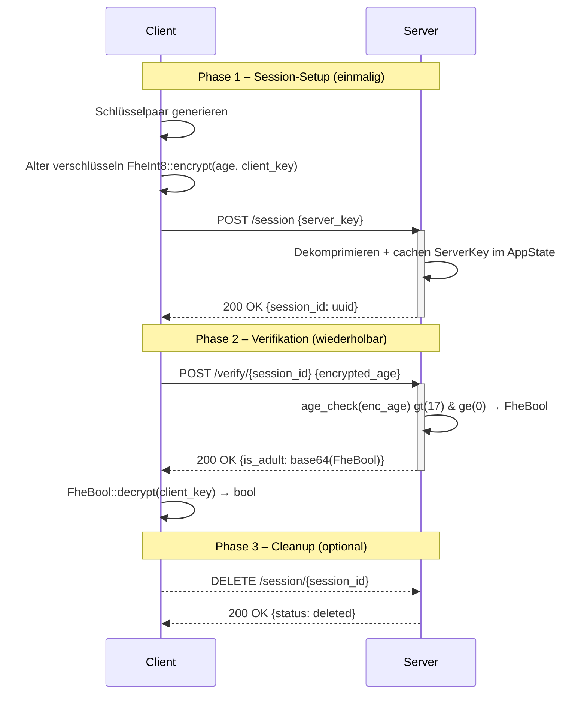

# Spezifikation
**für 02-encrypted-age-verification**
> [!NOTE]
> Pro umgesetztem Use Case sind die folgenden acht Sektionen verpflichtend. Die Sektionsstruktur ist für alle UCs identisch; die Detailtiefe darf je nach UC-Komplexität variieren (UC2 wird hier zwangsläufig weniger Inhalt haben als UC9).
---
---

### Funktionsbeschreibung
 
Der Use Case Encrypted Age Verification löst das Problem, das Alter einer Person serverseitig zu prüfen, ohne dass der Server den tatsächlichen Alterswert jemals im Klartext zu Gesicht bekommt. Das Ergebnis der Prüfung (volljährig: ja/nein) wird ebenfalls verschlüsselt zurückgegeben – der Server kennt weder Eingabe noch Ausgabe.
 
Das Alter wird bereits auf dem Client mit dem ClientKey verschlüsselt und ausschließlich in verschlüsselter Form an das Backend übertragen. Das Backend führt die Altersüberprüfung mittels Fully Homomorphic Encryption (TFHE) durch, ohne den zugrunde liegenden Alterswert entschlüsseln zu können. Die Entschlüsselung des Ergebnisses ist ausschließlich durch den Besitzer des ClientKeys möglich.
 
Der Service unterstützt zwei Betriebsmodi: einen zustandslosen Einzelrequest-Modus (`POST /`) sowie einen session-basierten Modus (`POST /session` + `POST /verify/{session_id}`), bei dem der ServerKey einmalig hochgeladen und gecacht wird. Der session-basierte Modus reduziert den Netzwerk-Overhead pro Verifikationsanfrage von ~80 MB auf ~88 KB.
 
#### Akteure
 
- **Client:** Generiert das TFHE-Schlüsselpaar, verschlüsselt das Alter mit dem `ClientKey`, kommuniziert mit dem Server und entschlüsselt das Ergebnis lokal. Der Client besitzt den `ClientKey` und ist der einzige Akteur, der das Ergebnis entschlüsseln kann.
- **Backend (Server):** Empfängt den `CompressedServerKey` (einmalig beim Session-Setup), cacht den dekomprimierten `ServerKey` im `AppState`, führt bei jedem Verify-Request die homomorphe Altersüberprüfung (`age_check`) durch und gibt das verschlüsselte Ergebnis (`FheBool`) zurück. Der Server sieht zu keinem Zeitpunkt das Alter oder das Ergebnis im Klartext.
#### Lebenszyklus einer Session
 
**Phase 1 – Session-Setup (einmalig):**

1. Client generiert `ClientKey` und `CompressedServerKey` lokal. Das Alter wird als `FheInt8` mit dem `ClientKey` verschlüsselt.
2. Client sendet `POST /session` mit dem `CompressedServerKey` (~80 MB) als JSON-Body.
3. Server dekomprimiert den Key einmalig (`CompressedServerKey::decompress()`), speichert den `ServerKey` im `AppState` und gibt eine `session_id` (UUID) zurück.

**Phase 2 – Verifikation (wiederholbar, ~88 KB):**

4. Client sendet `POST /verify/{session_id}` mit ausschließlich `encrypted_age` im Body.
5. Server liest den gecachten `ServerKey` aus dem `AppState`, führt `age_check` aus (`enc_age.gt(17) & enc_age.ge(0)`) und gibt das verschlüsselte `FheBool`-Ergebnis zurück.
6. Client entschlüsselt das `FheBool` mit dem `ClientKey` und erhält das boolesche Ergebnis.
 
**Phase 3 – Cleanup (optional):**

7. Client sendet `DELETE /session/{session_id}` um die Session zu beenden und den serverseitigen RAM freizugeben.

---

#### Verhaltensdiagramm


---

### OpenAPI-Schnittstelle
 
Der Service stellt eine session-basierte verschlüsselte Verifikations-API bereit. Die OpenAPI-Definition wird automatisch generiert und ist unter `/openapi.json` sowie `/docs` (Swagger UI) erreichbar.
 
Im gesamten Service wird der ServerKey als `CompressedServerKey` übertragen (bincode-serialisiert, base64-kodiert).
 
### POST /session
 
Lädt den `CompressedServerKey` einmalig hoch, dekomprimiert ihn und gibt eine `session_id` zurück.
 
#### Request
```json
{
  "server_key": "string"
}
```
 
#### Response 200
```json
{
  "session_id": "uuid"
}
```
 
#### Fehlercodes
- 400 – Ungültiges Base64 oder beschädigtes bincode in `server_key`
**Body-Limit:** 2 GiB (notwendig wegen der Größe des `CompressedServerKey`)
 
### POST /verify/{session_id}
 
Führt eine verschlüsselte Altersverifikation durch.
 
#### Request
```json
{
  "encrypted_age": "string"
}
```
 
#### Response 200
```json
{
  "is_adult": "string"
}
```
 
`is_adult` ist ein base64-kodierter, bincode-serialisierter `FheBool` — `true` wenn Alter ≥ 18 und ≥ 0.
 
#### Fehlercodes
- 400 – Ungültiges Base64 oder beschädigtes bincode in `encrypted_age`
- 404 – Session nicht gefunden
- 500 – Serialisierungsfehler beim Kodieren des Ergebnisses
### DELETE /session/{session_id}
 
Löscht die Session und gibt den serverseitigen RAM frei.
 
#### Response 200
```json
{
  "status": "deleted"
}
```
 
#### Fehlercodes
- 404 – Session nicht gefunden

---

### Trust- und Threat-Model

|                                 | Am Server klar | Am Server verschlüsselt | Nur am Client |
|---------------------------------|:--------------:|:-----------------------:|:-------------:|
| Alter (numerischer Wert)        |                | X                       |               |
| Ergebnis (volljährig: ja/nein)  |                | X                       |               |
| ServerKey / CompressedServerKey | X              |                         | X             |
| ClientKey                       |                |                         | X             |

#### Analyse: Beobachtbare Metadaten

TFHE schützt ausschließlich den Inhalt des Alters und des Ergebnisses. Für den Server bleiben weiterhin verschiedene Metadaten sichtbar:

- Zeitpunkte und Häufigkeit der Anfragen
- IP-Adresse des anfragenden Clients
- Charakteristische Payload-Größe (~80 MB), die auf TFHE-Schlüsselübertragung schließen lässt
- Anzahl der Anfragen pro IP

Da `age_check` eine datenunabhängige Berechnung ist (keine Branches auf verschlüsselten Werten), gibt es kein Timing-Side-Channel über die Rechendauer. Ein Server-Operator kann aus den Metadaten allenfalls Nutzungshäufigkeit ableiten, nicht jedoch das Alter einzelner Nutzer.

#### Restvertrauen in den Server

Der Server kann zwar das Alter nicht entschlüsseln, muss jedoch weiterhin als korrekter Ausführer der Verifikationslogik vertrauenswürdig sein. Insbesondere wird angenommen, dass der Server:

- `age_check` korrekt und unverändert ausführt (kein Austausch gegen eine Funktion, die immer `true` zurückgibt)
- Das korrekte `FheBool`-Ergebnis zurücksendet und es nicht durch einen manipulierten Ciphertext ersetzt
- Den ServerKey nicht persistiert oder weitergibt

TFHE reduziert somit die Vertrauensabhängigkeit hinsichtlich der Inhaltsvertraulichkeit, ersetzt jedoch kein vollständig vertrauensloses Protokoll.

#### Annahmen außerhalb von TFHE

Die Sicherheitsbetrachtung basiert auf folgenden Annahmen:

- Die Kommunikation zwischen Client und Server erfolgt über TLS.
- Der Client führt Verschlüsselung und Entschlüsselung korrekt aus.
- Die verwendete TFHE-rs-Bibliothek wird als kryptographisch korrekt implementierte Black Box betrachtet.
- Es gibt keine Authentifizierung am Endpunkt: Jeder, der einen gültigen `CompressedServerKey` besitzt, kann Anfragen stellen.

#### Schutzversprechen

Durch den Einsatz von TFHE wird garantiert:

- Der Server kann das Alter des Nutzers nicht im Klartext lesen.
- Der Server kann nicht feststellen, ob das Ergebnis `true` oder `false` ist.
- Das Alter wird ausschließlich verschlüsselt verarbeitet.

Nicht garantiert werden:

- Schutz vor einem Server, der `age_check` durch eine manipulierte Funktion ersetzt
- Schutz vor Traffic-Analyse (Payload-Größe, Timing)
- Authentizität des Clients (kein ZKP, dass der Client den ServerKey korrekt erzeugt hat)

**Konkret bedeutet das:** Der Server kennt nicht das Alter des Nutzers und kann nicht feststellen, ob das Ergebnis positiv oder negativ ausgefallen ist. Sichtbar bleiben ausschließlich Zeitpunkt, Herkunft und Häufigkeit der Anfragen.

---

### FHE-Designentscheidungen

#### Verwendete TFHE-rs-Typen

Für das Alter wird `FheInt8` (vorzeichenbehaftetes 8-Bit-Integer, Wertebereich −128 bis 127) verwendet. Diese Wahl ergibt sich aus zwei Gründen:

Altersangaben in Jahren liegen typischerweise im Bereich 0–127, also weit innerhalb von `i8`. `FheUint8` wäre für den positiven Ast ausreichend, aber `FheInt8` erlaubt es, negative Eingaben explizit als ungültig zu erkennen und abzufangen (s. `is_positive`-Check). Zudem unterstützt `FheInt8` `gt` und `ge` mit vorzeichenbehafteter Ganzzahlsemantik, was den Negativen-Grenzwert-Test (`ge(0)`) korrekt macht.

Das Ergebnis ist ein `FheBool` (verschlüsseltes Bit), was dem binären Charakter der Frage (volljährig: ja/nein) entspricht.

#### Verwendete homomorphe Operationen

Der Server führt ausschließlich zwei Vergleiche und eine boolesche Verknüpfung aus. Andere homomorphe Operationen werden nicht benötigt, dadurch bleibt die serverseitige Auswertung auf die minimal nötige Anzahl FHE-Operationen beschränkt.

| Operation         | Verwendung                           |
|-------------------|--------------------------------------|
| `FheInt8::gt`     | `enc_age > 17` → Alter ≥ 18          |
| `FheInt8::ge`     | `enc_age ≥ 0` → kein negativer Wert  |
| `FheBool::bitand` | Verknüpfung beider Bedingungen       |

#### Verworfene Alternativen

<u>`FheUint8` statt `FheInt8`</u>

Wäre für rein positive Eingaben ausreichend. Verworfen, weil damit keine sinnvolle Behandlung negativer Eingaben möglich ist – `FheUint8` interpretiert `−1` als `255`, was den Negativen-Grenzwert-Test (`age_check(-1) → false`) unmöglich machen würde.

<u>Schwellwert als verschlüsselter Parameter</u>

Denkbar wäre, den Grenzwert (18) ebenfalls als `FheInt8` zu übergeben, um ihn serverseitig variabel zu halten. Verworfen, weil der Schwellwert in diesem Use Case keine schützenswerte Information ist und eine feste Konstante die Implementierung erheblich vereinfacht.

<u>`FheInt32` oder größere Typen</u>

Größere Bitbreiten würden höhere Latenzen pro homomorpher Operation verursachen, ohne Mehrwert – Altersangaben benötigen keine mehr als 8 Bit.

---

### Komplexität der eigenen Algorithmen

Da der Use Case ausschließlich aus einer festen Anzahl homomorpher Operationen auf einem einzelnen Ciphertext besteht, gibt es keine parametrisierten Eingabegrößen. Die Komplexität aller Funktionen ist konstant.

| Funktion               | Zeitkomplexität | Platzkomplexität |
|------------------------|:---------------:|:----------------:|
| `decode_server_key`    | O(1)            | O(1)             |
| `decode_encrypted_age` | O(1)            | O(1)             |
| `age_check`            | O(1)            | O(1)             |
| `encode_result`        | O(1)            | O(1)             |
| `verify_age` (gesamt)  | O(1)            | O(1)             |

*verify_age – O(1), O(1)*

Die Funktion führt genau zwei Vergleiche (`gt(17)`, `ge(0)`) und eine AND-Verknüpfung (`&`) auf einem `FheInt8`-Wert durch. Alle drei sind Operationen fester Bitbreite (8 Bit) auf einem einzelnen Ciphertext – unabhängig von jeder Eingabegröße. Gemäß der Konvention, homomorphe Operationen als O(1) zu zählen, ist `age_check` ∈ O(1).

Die De- und Serialisierungsschritte (`bincode`, `base64`) operieren auf Byte-Arrays fester Länge (durch die TFHE-rs-Typen bestimmt) und sind ebenfalls O(1) bezüglich fachlicher Parameter.

---

### Performance-Messung
 
*Mess-Setup & Methodik*
 
Die Performance- und Stresstests wurden auf einem virtuellen KVM-Server von Netcup durchgeführt. Die Last wurde extern mittels k6 von einer lokalen Windows-Maschine über das Internet injiziert.
 
Die Messungen wurden für den session-basierten Modus durchgeführt. Getestet wurde `POST /verify/{session_id}` – der rechenintensive Endpunkt. `POST /session` (einmaliger Setup) und `DELETE /session/{id}` (Cleanup) wurden nicht separat belastet, da sie nicht im kritischen Pfad der Verifikation liegen.
 
Im session-basierten Modus entfällt die Netzwerkübertragung des ~80 MB ServerKey pro Request. Die Gesamtlatenz setzt sich jetzt aus zwei Anteilen zusammen:
 
1. Netzwerkübertragung von `encrypted_age` (~88 KB) – vernachlässigbar
2. `age_check()` – zwei FHE-Vergleiche + AND-Verknüpfung auf dem gecachten `ServerKey`
- Tool: k6 v2.0.0
- TFHE: `ConfigBuilder::default()`
- Datum: 09.06.2026
- Server: lokal (Entwicklungsmaschine)
*Test 1 – Baseline (1 VU, 10 sequentielle Requests, session-basiert) (09.06.2026)*
 
|Metrik       | Wert        |
|-------------|-------------|
|p50          | 114,17 ms   |
|p90          | 126,44 ms   |
|p95          | 132,74 ms   |
|Maximum      | 176,31 ms   |
|Fehlerrate   | 0 %         |
|Durchsatz    | 1,47 req/s  |
 
*Fazit von Test 1:*
 
Im session-basierten Modus entfällt der 80 MB ServerKey-Transfer pro Request. Die eigentliche FHE-Operation (`age_check`) dauert ~114 ms. p50 und p95 liegen eng beieinander (114 ms vs. 133 ms), was auf ein stabiles und vorhersehbares Systemverhalten hinweist.
 
*Test 2 – Stresstest (ramping bis 10 VUs, pro-VU Schlüsselpaar) (09.06.2026)*
 
Jede VU simuliert einen eigenen Client mit eigenem Schlüsselpaar und eigener Session. Der ServerKey-Upload (~80 MB) erfolgt einmalig pro VU beim ersten Request und wird separat als `setup_latency` gemessen.
 
|Metrik       | verify_latency | setup_latency (einmalig pro VU) |
|-------------|---------------|----------------------------------|
|p50          | 128 ms        | ~15 s                            |
|p90          | 151 ms        | ~16 s                            |
|p95          | 171 ms        | 21 s                             |
|Maximum      | 414 ms        | 26 s                             |
|Fehlerrate   | 0 %           | –                                |
|Durchsatz    | 3,07 req/s    | –                                |
 
*Fazit von Test 2:*
 
Unter paralleler Last mit 10 VUs bleibt die Verifikationslatenz stabil bei ~128 ms (p50) und steigt nur geringfügig auf 171 ms (p95) an. Es treten keine Timeouts oder Fehler auf. Der `set_server_key`-Mutex wirkt sich kaum aus, weil die FHE-Operation mit ~128 ms kurz genug ist, dass die Wartezeit vernachlässigbar bleibt.
 
Die `setup_latency` (p95: 21 s) spiegelt den einmaligen 80 MB ServerKey-Upload pro Client wider – dieser Wert fällt nicht in den kritischen Pfad der Verifikation und tritt pro Client nur einmal auf.
 
---

### Limitationen

- Der `CompressedServerKey` (~80 MB) wird einmalig beim Session-Setup übertragen und dekomprimiert gecacht. Folgende Verify-Requests enthalten nur noch `encrypted_age` (~88 KB). Der gecachte `ServerKey` verbleibt im RAM des Servers bis die Session per `DELETE /session/{id}` beendet wird – es gibt keine automatische Ablaufzeit.

- Sessions haben keine Authentifizierung: Jeder, der eine `session_id` kennt, kann Verify-Requests gegen diese Session stellen. In einer produktiven Umgebung müsste die Session an eine authentifizierte Identität gebunden sein.

- Der Server prüft nicht, ob ein `encrypted_age`-Ciphertext bereits zuvor verwendet wurde. Ein Angreifer, der einen Ciphertext abfängt, kann ihn beliebig oft einreichen.

- Der Client übergibt den `CompressedServerKey` selbst. Ein bösartiger Client könnte einen manipulierten Key einreichen. In einer produktiven Umgebung müsste der ServerKey serverseitig fest hinterlegt sein.

- Der Client könnte einen beliebigen `FheInt8`-Wert übermitteln – der Server kann nicht verifizieren, dass die verschlüsselte Eingabe tatsächlich ein Alter darstellt oder aus einer vertrauenswürdigen Quelle stammt (kein Zero-Knowledge-Beweis).

- Maximal darstellbarer Alterswert ist 127 Jahre (`i8::MAX`). Dies ist für den Anwendungsfall ausreichend, aber die Wahl von `FheInt8` schließt größere Ganzzahlen strukturell aus.

- Es gibt keine Authentifizierung am Endpunkt. Jeder, der die API kennt, kann Anfragen stellen. Ein Gateway-Layer (z. B. API-Key, mTLS) ist in der aktuellen Implementierung nicht vorhanden.

- Durch den globalen `set_server_key`-Aufruf ist echte Parallelverarbeitung nicht möglich. Der Durchsatz skaliert nicht mit der Anzahl der CPU-Kerne.

---