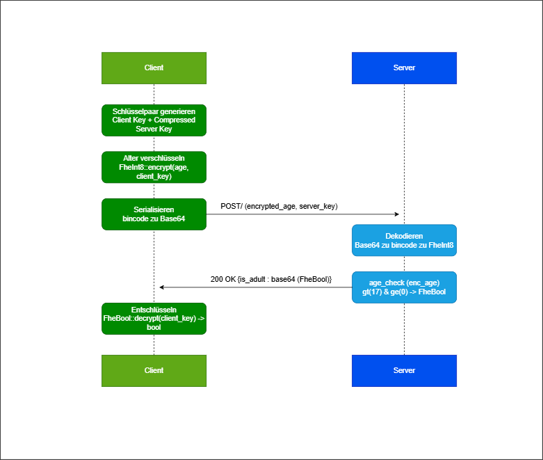

# Spezifikation
**für 02-encrypted-age-verification**
> [!NOTE]
> Pro umgesetztem Use Case sind die folgenden acht Sektionen verpflichtend. Die Sektionsstruktur ist für alle UCs identisch; die Detailtiefe darf je nach UC-Komplexität variieren (UC2 wird hier zwangsläufig weniger Inhalt haben als UC9).
---
---

### Funktionsbeschreibung

Der Use Case Encrypted Age Verification löst das Problem, das Alter einer Person serverseitig zu prüfen, ohne dass der Server den tatsächlichen Alterswert jemals im Klartext zu Gesicht bekommt. Das Ergebnis der Prüfung (volljährig: ja/nein) wird ebenfalls verschlüsselt zurückgegeben – der Server kennt weder Eingabe noch Ausgabe.

Das Alter wird bereits auf dem Client mit dem ClientKey verschlüsselt und ausschließlich in verschlüsselter Form an das Backend übertragen. Das Backend führt die Altersüberprüfung mittels Fully Homomorphic Encryption (TFHE) durch, ohne den zugrunde liegenden Alterswert entschlüsseln zu können. Die Entschlüsselung des Ergebnisses ist ausschließlich durch den Besitzer des ClientKeys möglich.

#### Akteure

- **Client:** Generiert das TFHE-Schlüsselpaar, verschlüsselt das Alter mit dem `ClientKey`, sendet `encrypted_age` und `server_key` an den Server, empfängt das verschlüsselte Ergebnis und entschlüsselt es lokal. Der Client besitzt den `ClientKey` und ist der einzige Akteur, der das Ergebnis entschlüsseln kann.

- **Backend (Server):** Empfängt `encrypted_age` und `CompressedServerKey`, setzt den ServerKey, führt die homomorphe Altersüberprüfung (`age_check`) durch und gibt das verschlüsselte Ergebnis (`FheBool`) zurück. Der Server sieht zu keinem Zeitpunkt das Alter oder das Ergebnis im Klartext.

#### Lebenszyklus einer Session

Da dieser Use Case vollständig zustandslos ist, gibt es keine persistente Session. Der gesamte Ablauf findet innerhalb eines einzelnen HTTP-Requests statt:

1. **Vorbereitung (Client):** Client generiert `ClientKey` und `CompressedServerKey` lokal. Das Alter wird als `FheInt8` mit dem `ClientKey` verschlüsselt. Beide Werte werden bincode-serialisiert und base64-kodiert.
2. **Request:** Client sendet `POST /` mit `encrypted_age` und `server_key` als JSON-Body.
3. **Verarbeitung (Server):** Server dekodiert und deserialisiert beide Felder, setzt den ServerKey im globalen Thread-Kontext und führt `age_check` aus: `enc_age.gt(17) & enc_age.ge(0)`.
4. **Response:** Server serialisiert das `FheBool`-Ergebnis, base64-kodiert es und gibt es als `is_adult` zurück.
5. **Auswertung (Client):** Client dekodiert und deserialisiert `is_adult`, entschlüsselt das `FheBool` mit dem `ClientKey` und erhält das boolesche Ergebnis.

#### Verhaltensdiagramm



---

### OpenAPI-Schnittstelle

Der Service stellt eine einzelne verschlüsselte Verifikations-API bereit. Die OpenAPI-Definition wird automatisch generiert und ist unter `/openapi.json` sowie `/docs` (Swagger UI) erreichbar.

Im gesamten Service wird der ServerKey als `CompressedServerKey` übertragen (bincode-serialisiert, base64-kodiert).

### POST /

Führt eine verschlüsselte Altersverifikation durch.

#### Request
```json
{
  "encrypted_age": "string",
  "server_key": "string"
}
```

#### Response 200
```json
{
  "is_adult": "string"
}
```

`is_adult` ist ein base64-kodierter, bincode-serialisierter `FheBool` — `true` wenn Alter ≥ 18 und ≥ 0.

#### Fehlercodes
- 400 – Ungültiges Base64 oder beschädigtes bincode in `server_key` oder `encrypted_age`
- 500 – Serialisierungsfehler beim Kodieren des Ergebnisses

**Body-Limit:** 2 GiB (notwendig wegen der Größe des `CompressedServerKey`)

---

### Trust- und Threat-Model

|                                 | Am Server klar | Am Server verschlüsselt | Nur am Client |
|---------------------------------|:--------------:|:-----------------------:|:-------------:|
| Alter (numerischer Wert)        |                | X                       |               |
| Ergebnis (volljährig: ja/nein)  |                | X                       |               |
| ServerKey / CompressedServerKey | X              |                         | X             |
| ClientKey                       |                |                         | X             |

#### Analyse: Beobachtbare Metadaten

TFHE schützt ausschließlich den Inhalt des Alters und des Ergebnisses. Für den Server bleiben weiterhin verschiedene Metadaten sichtbar:

- Zeitpunkte und Häufigkeit der Anfragen
- IP-Adresse des anfragenden Clients
- Charakteristische Payload-Größe (~80 MB), die auf TFHE-Schlüsselübertragung schließen lässt
- Anzahl der Anfragen pro IP

Da `age_check` eine datenunabhängige Berechnung ist (keine Branches auf verschlüsselten Werten), gibt es kein Timing-Side-Channel über die Rechendauer. Ein Server-Operator kann aus den Metadaten allenfalls Nutzungshäufigkeit ableiten, nicht jedoch das Alter einzelner Nutzer.

#### Restvertrauen in den Server

Der Server kann zwar das Alter nicht entschlüsseln, muss jedoch weiterhin als korrekter Ausführer der Verifikationslogik vertrauenswürdig sein. Insbesondere wird angenommen, dass der Server:

- `age_check` korrekt und unverändert ausführt (kein Austausch gegen eine Funktion, die immer `true` zurückgibt)
- Das korrekte `FheBool`-Ergebnis zurücksendet und es nicht durch einen manipulierten Ciphertext ersetzt
- Den ServerKey nicht persistiert oder weitergibt

TFHE reduziert somit die Vertrauensabhängigkeit hinsichtlich der Inhaltsvertraulichkeit, ersetzt jedoch kein vollständig vertrauensloses Protokoll.

#### Annahmen außerhalb von TFHE

Die Sicherheitsbetrachtung basiert auf folgenden Annahmen:

- Die Kommunikation zwischen Client und Server erfolgt über TLS.
- Der Client führt Verschlüsselung und Entschlüsselung korrekt aus.
- Die verwendete TFHE-rs-Bibliothek wird als kryptographisch korrekt implementierte Black Box betrachtet.
- Es gibt keine Authentifizierung am Endpunkt: Jeder, der einen gültigen `CompressedServerKey` besitzt, kann Anfragen stellen.

#### Schutzversprechen

Durch den Einsatz von TFHE wird garantiert:

- Der Server kann das Alter des Nutzers nicht im Klartext lesen.
- Der Server kann nicht feststellen, ob das Ergebnis `true` oder `false` ist.
- Das Alter wird ausschließlich verschlüsselt verarbeitet.

Nicht garantiert werden:

- Schutz vor einem Server, der `age_check` durch eine manipulierte Funktion ersetzt
- Schutz vor Traffic-Analyse (Payload-Größe, Timing)
- Authentizität des Clients (kein ZKP, dass der Client den ServerKey korrekt erzeugt hat)

**Konkret bedeutet das:** Der Server kennt nicht das Alter des Nutzers und kann nicht feststellen, ob das Ergebnis positiv oder negativ ausgefallen ist. Sichtbar bleiben ausschließlich Zeitpunkt, Herkunft und Häufigkeit der Anfragen.

---

### FHE-Designentscheidungen

#### Verwendete TFHE-rs-Typen

Für das Alter wird `FheInt8` (vorzeichenbehaftetes 8-Bit-Integer, Wertebereich −128 bis 127) verwendet. Diese Wahl ergibt sich aus zwei Gründen:

Altersangaben in Jahren liegen typischerweise im Bereich 0–127, also weit innerhalb von `i8`. `FheUint8` wäre für den positiven Ast ausreichend, aber `FheInt8` erlaubt es, negative Eingaben explizit als ungültig zu erkennen und abzufangen (s. `is_positive`-Check). Zudem unterstützt `FheInt8` `gt` und `ge` mit vorzeichenbehafteter Ganzzahlsemantik, was den Negativen-Grenzwert-Test (`ge(0)`) korrekt macht.

Das Ergebnis ist ein `FheBool` (verschlüsseltes Bit), was dem binären Charakter der Frage (volljährig: ja/nein) entspricht.

#### Verwendete homomorphe Operationen

Der Server führt ausschließlich zwei Vergleiche und eine boolesche Verknüpfung aus. Andere homomorphe Operationen werden nicht benötigt, dadurch bleibt die serverseitige Auswertung auf die minimal nötige Anzahl FHE-Operationen beschränkt.

| Operation         | Verwendung                           |
|-------------------|--------------------------------------|
| `FheInt8::gt`     | `enc_age > 17` → Alter ≥ 18          |
| `FheInt8::ge`     | `enc_age ≥ 0` → kein negativer Wert  |
| `FheBool::bitand` | Verknüpfung beider Bedingungen       |

#### Verworfene Alternativen

<u>`FheUint8` statt `FheInt8`</u>

Wäre für rein positive Eingaben ausreichend. Verworfen, weil damit keine sinnvolle Behandlung negativer Eingaben möglich ist – `FheUint8` interpretiert `−1` als `255`, was den Negativen-Grenzwert-Test (`age_check(-1) → false`) unmöglich machen würde.

<u>Schwellwert als verschlüsselter Parameter</u>

Denkbar wäre, den Grenzwert (18) ebenfalls als `FheInt8` zu übergeben, um ihn serverseitig variabel zu halten. Verworfen, weil der Schwellwert in diesem Use Case keine schützenswerte Information ist und eine feste Konstante die Implementierung erheblich vereinfacht.

<u>`FheInt32` oder größere Typen</u>

Größere Bitbreiten würden höhere Latenzen pro homomorpher Operation verursachen, ohne Mehrwert – Altersangaben benötigen keine mehr als 8 Bit.

---

### Komplexität der eigenen Algorithmen

Da der Use Case ausschließlich aus einer festen Anzahl homomorpher Operationen auf einem einzelnen Ciphertext besteht, gibt es keine parametrisierten Eingabegrößen. Die Komplexität aller Funktionen ist konstant.

| Funktion               | Zeitkomplexität | Platzkomplexität |
|------------------------|:---------------:|:----------------:|
| `decode_server_key`    | O(1)            | O(1)             |
| `decode_encrypted_age` | O(1)            | O(1)             |
| `age_check`            | O(1)            | O(1)             |
| `encode_result`        | O(1)            | O(1)             |
| `verify_age` (gesamt)  | O(1)            | O(1)             |

*verify_age – O(1), O(1)*

Die Funktion führt genau zwei Vergleiche (`gt(17)`, `ge(0)`) und eine AND-Verknüpfung (`&`) auf einem `FheInt8`-Wert durch. Alle drei sind Operationen fester Bitbreite (8 Bit) auf einem einzelnen Ciphertext – unabhängig von jeder Eingabegröße. Gemäß der Konvention, homomorphe Operationen als O(1) zu zählen, ist `age_check` ∈ O(1).

Die De- und Serialisierungsschritte (`bincode`, `base64`) operieren auf Byte-Arrays fester Länge (durch die TFHE-rs-Typen bestimmt) und sind ebenfalls O(1) bezüglich fachlicher Parameter.

---

### Performance-Messung

*Mess-Setup & Methodik*

Die Performance- und Stresstests wurden auf einem virtuellen KVM-Server von Netcup mit dedizierten CPU-Ressourcen durchgeführt. Die Last wurde extern mittels k6 von einer lokalen Windows-Maschine über das Internet injiziert.

Es wurde ein einziger relevanter Endpunkt getestet: `POST /`. Alle anderen Endpunkte (`/health`, `/docs`) stellen nur Grundrauschen dar und wurden nicht gemessen.

Die gemessene Gesamtlatenz setzt sich daher aus drei Anteilen zusammen:

1. Netzwerkübertragung des ~80 MB ServerKey (dominanter Anteil bei Remote-Messung)
2. `CompressedServerKey::decompress()` – rechenintensive Dekomprimierung
3. `age_check()` – zwei FHE-Vergleiche + AND-Verknüpfung

Die gemessenen Latenzen spiegeln den realistischen End-to-End-Overhead des zustandslosen Designs wider.

- Tool: k6 v2.0.0
- TFHE: `ConfigBuilder::default()`
- Datum: 05.06.2026
- Server: Netcup KVM

*Test 1 – Baseline (1 VU, 10 sequentielle Requests) (05.06.2026)*

|Metrik       | Wert        |
|-------------|-------------|
|p50          | 13,65 s     |
|p90          | 29,26 s     |
|p95          | 43,51 s     |
|Maximum      | 60,00 s     |
|Fehlerrate   | 0 %         |
|Durchsatz    | ~0,05 req/s |

*Fazit von Test 1:*

Bereits bei einem einzelnen sequentiellen Client ist die Latenz hoch. Der dominierende Faktor ist die Übertragung des ~80 MB ServerKey über das Internet sowie dessen Dekomprimierung. Die hohe Varianz zwischen p50 (13,65 s) und p95 (43,51 s) deutet darauf hin, dass Netzwerkschwankungen einen erheblichen Einfluss haben.

*Test 2 – Stresstest (ramping bis 10 VUs) (05.06.2026)*

|Metrik       | Wert        |
|-------------|-------------|
|p50          | 13,65 s     |
|p90          | 37,23 s     |
|p95          | 48,84 s     |
|Maximum      | 60,00 s     |
|Fehlerrate   | 30 %        |
|Durchsatz    | ~0,05 req/s |

*Fazit von Test 2:*

Unter paralleler Last bricht die Fehlerrate auf 30 % ein. Die Fehler sind ausschließlich HTTP 499 (Client Closed Request) und HTTP 504 (Gateway Timeout) – der vorgelagerte Nginx-Proxy trennt Verbindungen nach 60 s, bevor der Server die Verarbeitung abschließen kann. Der Server selbst lief dabei vollständig stabil und verarbeitete alle Anfragen ohne eigene Fehler.

Die Throughput-Grenze liegt bei einem parallelen Request. Jeder weitere gleichzeitige Request verlängert die Wartezeit linear, da `tfhe::set_server_key` einen globalen Thread-Kontext setzt und die gesamte Verarbeitung (Übertragung + Dekomprimierung + FHE) serialisiert wird. Ab 2 VUs überschreitet p95 den Proxy-Timeout von 60 s regelmäßig.

---

### Limitationen

- Der Use Case ist vollständig zustandslos. Es gibt keine Session, keine Audit-Log und keine Möglichkeit, Ergebnisse serverseitig zu speichern oder abzurufen.

- Der `CompressedServerKey` (~80 MB) wird bei jedem einzelnen Request vom Client mitgeschickt, deserialisiert und dekomprimiert.Dieses Design ist eine direkte Konsequenz der Zustandslosigkeit: Da jeder Client sein eigenes Schlüsselpaar generiert, kann kein globaler ServerKey serverseitig gespeichert werden, ohne das Sicherheitsmodell zu brechen. Ein gespeicherter ServerKey eines anderen Clients würde es diesem ermöglichen, fremde Ergebnisse zu entschlüsseln. Die Folge ist, dass Netzwerkübertragung und Dekomprimierung die Latenz dominieren und ein produktiver Einsatz über das Internet praktisch nicht skaliert.

- Der Server prüft nicht, ob ein `encrypted_age`-Ciphertext bereits zuvor verwendet wurde. Ein Angreifer, der einen Ciphertext abfängt, kann ihn beliebig oft einreichen.

- Der Client übergibt den `CompressedServerKey` selbst. Ein bösartiger Client könnte einen manipulierten Key einreichen. In einer produktiven Umgebung müsste der ServerKey serverseitig fest hinterlegt sein.

- Der Client könnte einen beliebigen `FheInt8`-Wert übermitteln – der Server kann nicht verifizieren, dass die verschlüsselte Eingabe tatsächlich ein Alter darstellt oder aus einer vertrauenswürdigen Quelle stammt (kein Zero-Knowledge-Beweis).

- Maximal darstellbarer Alterswert ist 127 Jahre (`i8::MAX`). Dies ist für den Anwendungsfall ausreichend, aber die Wahl von `FheInt8` schließt größere Ganzzahlen strukturell aus.

- Es gibt keine Authentifizierung am Endpunkt. Jeder, der die API kennt, kann Anfragen stellen. Ein Gateway-Layer (z. B. API-Key, mTLS) ist in der aktuellen Implementierung nicht vorhanden.

- Durch den globalen `set_server_key`-Aufruf ist echte Parallelverarbeitung nicht möglich. Der Durchsatz skaliert nicht mit der Anzahl der CPU-Kerne.

---