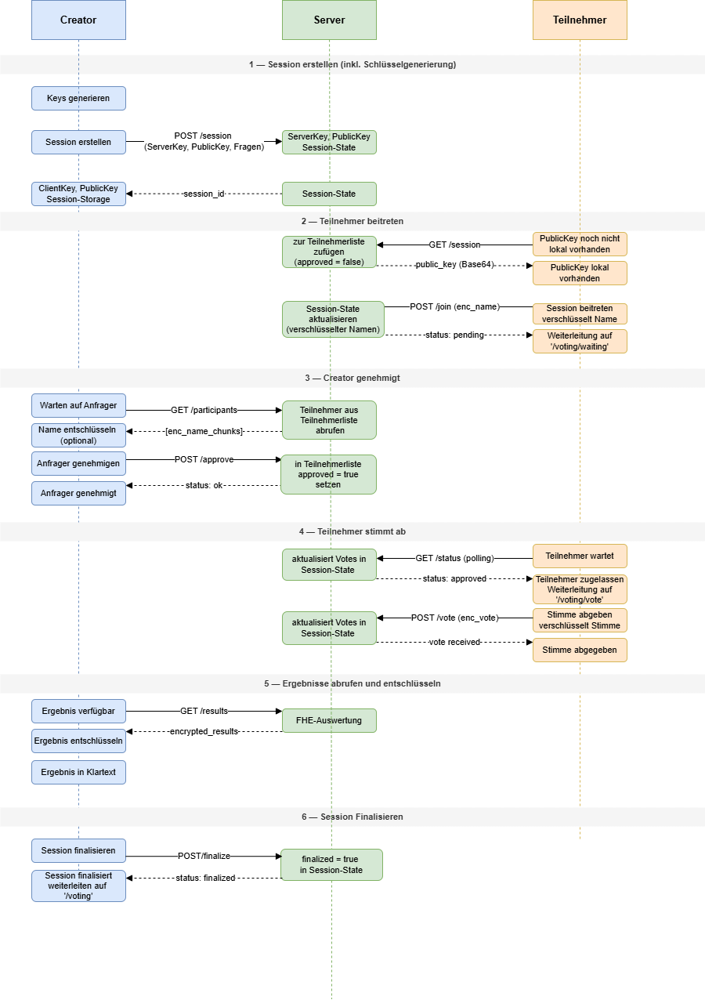
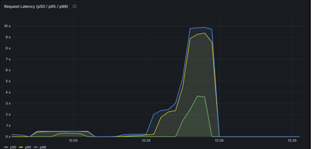

# Spezifikation
**für 03-encrypted-voting-polling**
> [!NOTE]
> Pro umgesetztem Use Case sind die folgenden acht Sektionen verpflichtend. Die Sektionsstruktur ist für alle UCs identisch; die Detailtiefe darf je nach UC-Komplexität variieren (UC2 wird hier zwangsläufig weniger Inhalt haben als UC9).
---

### Funktionsbeschreibung

Der Use Case Voting/Polling ermöglicht die Durchführung vertraulicher Abstimmungen zwischen mehreren Teilnehmern. Ziel ist es, Abstimmungsergebnisse auszuwerten, ohne dass der Server Zugriff auf die einzelnen Stimmen der Teilnehmer erhält. 

Hierzu werden Stimmen bereits auf dem Client verschlüsselt und ausschließlich in verschlüsselter Form an das Backend übertragen. Das Backend verarbeitet und aggregiert die verschlüsselten Stimmen mittels Fully Homomorphic Encryption (TFHE), ohne die zugrunde liegenden Klartexte entschlüsseln zu können. Die Entschlüsselung der aggregierten Ergebnisse ist ausschließlich durch den Besitzer des ClientKeys möglich. 

Der Use Case unterstützt die Fragetypen Single Choice, Multiple Choice und Numeric. Eine Abstimmungssession kann beliebig viele Fragen enthalten und von mehreren Teilnehmern genutzt werden. 

#### Akteure:

- **Ersteller (Client E):**
Der Ersteller generiert das TFHE-Schlüsselpaar, definiert die Fragen und erstellt die Voting-Session. Zusätzlich verwaltet er die Teilnahme der Nutzer (Genehmigung oder Ablehnung). Der Client E besitzt den ClientKey und ist der einzige Akteur, der Ergebnisse entschlüsseln kann. 

- **Teilnehmer (Client):**
Ein Teilnehmer kann einer Session beitreten, indem er die Session-ID und seinen verschlüsselten Namen an den Server sendet. Nach Genehmigung durch den Ersteller kann der Teilnehmer seine Stimme(n) abgeben. Sowohl Name als auch Stimme werden clientseitig mit dem PublicKey verschlüsselt und an den Server übertragen. Teilnehmer können zu keinem Zeitpunkt die aggregierten Ergebnisse einsehen. 

- **Backend (Server):**
Der Server verwaltet Sessions, Teilnehmerstatus und gespeicherte Ciphertexts. Er führt homomorphe Aggregationen auf verschlüsselten Stimmen durch, hat jedoch keinen Zugriff auf Klartextinformationen von Namen oder Stimmen. 

#### Lebenszyklus einer Session:

1. **Erstellung:**  Der Ersteller generiert ein TFHE-Schlüsselpaar und erstellt eine Session mit eindeutiger UUID. Der PublicKey und ServerKey werden an das Backend übergeben, der ClientKey verbleibt ausschließlich beim Ersteller in der Session Storage. 
2. **Teilnahme:** Teilnehmer gibt Session-ID und Name ein und klickt auf Beitreten. Das Frontend versucht den PublicKey aus der Session Storage abzurufen, falls er dort noch nicht vorliegt, wird er vom Backend geladen und in der Session Storage gespeichert. Mit dem PublicKey wird der Name verschlüsselt und eine Beitrittsanfrage an den Server gesendet. Der Status ist zunächst pending. 
3. **Genehmigung:** Der Ersteller entschlüsselt den Teilnehmernamen und genehmigt oder lehnt die Teilnahme ab. Der Teilnehmerstatus wird serverseitig aktualisiert. 
4. **Abstimmung:** Genehmigte Teilnehmer beantworten die Fragen der Session und geben ihre Stimme ab. Ihre Stimmen werden mit dem PublicKey verschlüsselt und an den Server gesendet. Der Server speichert ausschließlich Ciphertexts. 
5. **Auswertung:** Nachdem der Ersteller auf “Auswertung anzeigen” klickt, wird geprüft, ob alle zugelassenen Teilnehmer bereits abgestimmt haben bzw. ob mindestens ein Vote vorhanden ist. Wenn dies der Fall ist, aggregiert der Server alle verschlüsselten Stimmen mittels homomorpher Addition und stellt die aggregierten Ciphertexts dem Ersteller zur Verfügung. Der Ersteller kann zu jedem Zeitpunkt versuchen die aktuell aggregierten Ergebnisse vom Server abzurufen und lokal zu entschlüsseln, bis die Session finalisiert wurde. 
6. **Schließen:** Die Session bleibt aktiv, bis der Ersteller sie explizit als finalized markiert oder bei 10 Minuten Inaktivität. Bis zu diesem Zeitpunkt können Teilnehmer der Session beitreten und nach Genehmigung Stimmen abgeben, und alle eingehenden Votes werden in die Aggregation einbezogen. 
Mit der Finalisierung wird die Session vollständig geschlossen. Ab diesem Zeitpunkt: 
    1. Können keine neuen Teilnehmer mehr beitreten  
    2. Können keine weiteren Stimmen abgegeben werden  
    3. Wird der Client aus der Manage-Session-Ansicht heraus zur Startseite weitergeleitet 

#### Verhaltensdiagramm



### OpenAPI-Schnittstelle

Der Service stellt eine fachliche Voting-/Polling-API bereit, mit der Sessions erstellt, Teilnehmer verwaltet und verschlüsselte Stimmen abgegeben werden können. Die OpenAPI-Definition wird automatisch generiert und ist unter `/openapi.json` sowie `/docs` (Swagger UI) verfügbar.

Im gesamten Service wird der PublicKey als CompressedPublicKey verwendet. Dieser ermöglicht eine Batch-Verschlüsselung.
### POST /session

Legt eine neue Voting-Session an.

#### Request
```json
{
  "creator_id": "string",
  "server_key": "string",
  "public_key": "string | null",
  "questions": [
    {
      "id": 0,
      "text": "string",
      "question_type": "single | multiple | numeric",
      "options": ["string"]
    }
  ]
}
```
#### Response 200
```json
{ "session_id": "uuid" }
```

#### Fehlercodes
- 400 – Invalid Base64 oder beschädigtes bincode im server_key

### GET /session/{session_id}

Gibt die Metadaten einer Session für Teilnehmer zurück.

#### Response 200
```json
{
  "session_id": "uuid",
  "questions": [
    {
      "id": 0,
      "text": "string",
      "question_type": "single | multiple | numeric",
      "options": ["string"]
    }
  ],
  "public_key": "string | null"
}
```

#### Fehlercodes
- 404 – Session nicht gefunden

### POST /join

Teilnehmer beantragt den Beitritt zu einer Session. Der Beitritt ist zunächst pending und muss vom Creator freigegeben werden.

#### Request
```json
{
  "session_id": "uuid",
  "participant_id": "string",
  "enc_name_chunks": ["string"]
}
```

#### Response 200
```json
{ "status": "pending" }
```

#### Fehlercodes
- 404 – Session nicht gefunden
- 409 – Session bereits beendet

### POST /approve

Der Creator genehmigt oder lehnt Teilnehmer ab.

#### Request
```json
{
  "session_id": "uuid",
  "creator_id": "string",
  "participant_id": "string",
  "approved": true
}
```
#### Response 200
```json
{ "status": "ok" }
```

#### Fehlercodes
- 404 – Session nicht gefunden
- 403 – Nicht autorisiert (falscher creator_id)
- 409 – Session bereits beendet
- 404 – Teilnehmer nicht gefunden (nur bei approval=true relevant)

### POST /vote

Ein genehmigter Teilnehmer sendet seine verschlüsselten Votes.

#### Request
```json
{
  "session_id": "uuid",
  "participant_id": "string",
  "encrypted_votes": [
    ["string"],
    ["string"]
  ]
}
```
#### Response 200
```json
{ "status": "vote received" }
```

#### Fehlercodes
- 404 – Session nicht gefunden
- 404 – Teilnehmer nicht gefunden
- 403 – Teilnehmer nicht genehmigt
- 409 – Session bereits beendet
- 400 – Anzahl der Votes stimmt nicht mit Fragen überein

### GET /status/{session_id}/{participant_id}

Liefert den aktuellen Status eines Teilnehmers.

#### Response 200
```json
{
  "status": "approved | pending | not_found"
}
```

#### Fehlercodes
- 404 – Session nicht gefunden

### GET /participants/{session_id}/{creator_id}

Gibt eine Admin-Übersicht aller Teilnehmer zurück.

#### Response 200
```json
[
  {
    "participant_id": "string",
    "approved": true,
    "has_voted": false,
    "enc_name_chunks": ["string"]
  }
]
```

#### Fehlercodes
- 404 – Session nicht gefunden
- 403 – Nicht autorisiert

### GET /results/{session_id}/{creator_id}

Gibt die homomorph aggregierten Ergebnisse zurück (nur Creator).

Wenn noch nicht alle Votes vorhanden sind, ist ready = false.

#### Response (ready)
```json
{
  "encrypted_results": [
    ["string"]
  ],
  "ready": true
}
```
#### Response (not ready)
```json
{
  "encrypted_results": [],
  "ready": false
}
```

#### Fehlercodes
- 404 – Session nicht gefunden
- 403 – Nicht autorisiert

### POST /finalize/{session_id}/{creator_id}

Schließt die Session endgültig. Danach sind keine Votes oder Joins mehr möglich.

#### Response 200
```json
{ "status": "finalized" }
```

#### Fehlercodes
- 404 – Session nicht gefunden
- 403 – Nicht autorisiert
- 409 – Session bereits finalisiert

### Trust- und Threat-Model

| Datum                                | Am Server klar | Am Server verschlüsselt | Am Client |
| ------------------------------------ | -------------- | ------------------------ | --------- |
| Session_id (UUID)                    | X              |                          | X         |
| Creator_id                           | X              |                          | X         |
| Participant_id                       | X              |                          | X         |
| Fragen                               | X              |                          | X         |
| Antwortoptionen                      | X              |                          | X         |
| Teilnehmerstatus                     | X              |                          | X         |
| Abstimmungszeitpunkte                | X              |                          | X         |
| Anzahl Teilnehmer/Votes              | X              |                          | X         |
| Session State (finalized)            | X              |                          | X         |
| Public Key der Session               | X              |                          | X         |
| Server Key                           | X              |                          | X         |
| Teilnehmernamen (verschlüsselt)      |                | X                        | X         |
| Teilnehmernamen (entschlüsselt)      |                |                          | X         |
| Vote Inhalt                          |                | X                        |           |
| Aggregierte Ergebnisse (verschlüsselt) |              | X                        | X         |
| Aggregierte Ergebnisse (entschlüsselt) |              |                          | X         |
| Client Key                           |                |                          | X         |

#### Analyse: Beobachtbare Metadaten 
TFHE schützt ausschließlich die Inhalte von Stimmen und Ergebnissen. Für den Server bleiben weiterhin verschiedene Metadaten sichtbar: 

- Anzahl und Aktivität von Sessions  
- Anzahl der Teilnehmer pro Session  
- Anzahl abgegebener Stimmen  
- Zeitpunkte von Beitritt, Genehmigung und Abstimmung  
- Request-Timing und Voting-Pattern  
- Umfragestruktur (Fragen und Antwortoptionen)  
- Teilnehmerstatus (pending, approved, has_voted)  
- Polling-Verhalten der Admin-Oberfläche  

Ein Server-Operator kann daraus Rückschlüsse auf Aktivitätsmuster, soziale Dynamiken, die Größe einer Abstimmung oder mögliche Zusammenhänge zwischen Abstimmungszeitpunkten und Teilnehmerverhalten ziehen. 

#### Restvertrauen in den Server 

Der Server kann zwar keine Stimmen entschlüsseln, muss jedoch weiterhin als korrekter Ausführer des Protokolls vertrauenswürdig sein. Insbesondere wird angenommen, dass der Server: 

- Teilnehmer korrekt Sessions zuordnet  
- Join- und Approval-Prozesse korrekt verarbeitet  
- Stimmen vollständig speichert und nicht verwirft  
- Sessions voneinander trennt  
- Homomorphe Aggregationen korrekt ausführt  
- Die Verfügbarkeit des Systems sicherstellt  

TFHE reduziert somit die Vertrauensabhängigkeit hinsichtlich der Inhaltsvertraulichkeit, ersetzt jedoch kein vollständig vertrauensloses Protokoll. 

#### Annahmen außerhalb von TFHE 

Die Sicherheitsbetrachtung basiert auf folgenden Annahmen: 

- Die Kommunikation zwischen Client und Server erfolgt über TLS.  
- Das Frontend führt die Verschlüsselung und Entschlüsselung korrekt aus.  
- Die verwendete TFHE-rs-Bibliothek wird als kryptographisch korrekt implementierte Black Box betrachtet.  
- Der ClientKey verbleibt ausschließlich beim Session-Ersteller.  

Das System besitzt keine starke Benutzerauthentifizierung, die Teilnahme erfolgt ausschließlich über Session-ID und frei gewählten Namen. 

#### Schutzversprechen 

Durch den Einsatz von TFHE wird garantiert: 

- Der Server kann individuelle Stimmen nicht im Klartext lesen.  
- Der Server kann einzelne Abstimmungsentscheidungen nicht rekonstruieren.  
- Stimmen werden ausschließlich verschlüsselt verarbeitet.  
- Auch aggregierte Ergebnisse liegen auf dem Server nur verschlüsselt vor.  

Nicht garantiert werden: 

- Vertraulichkeit der Umfragestruktur  
- Vertraulichkeit von Metadaten und Abstimmungszeitpunkten  
- Schutz vor Traffic- und Timing-Analysen  
- Schutz vor aktiv manipulierendem Serververhalten  
- Fairness oder Vollständigkeit der Protokollausführung  

**Konkret bedeutet das:** Der Server kennt nicht den Inhalt einer abgegebenen Stimme und kann nicht feststellen, welche Antwort ein Teilnehmer gewählt hat. Sichtbar bleiben jedoch Existenz, Zeitpunkt und organisatorischer Kontext der Abstimmung.

#### Einordnung 

Der Use Case implementiert ein TFHE-geschütztes Abstimmungssystem mit Vertraulichkeit auf Inhaltsebene. Geschützt werden ausschließlich individuelle Stimmen und deren aggregierte Ergebnisse. Metadaten, Umfragestruktur und der allgemeine Kontrollfluss der Anwendung bleiben außerhalb des Schutzbereichs von TFHE. 

### FHE-Designentscheidungen

#### Verwendete TFHE-rs-Typen 

Für die Repräsentation der Stimmen wird primär der Datentyp FheUint32 verwendet. Obwohl die einzelnen Eingabewerte der Teilnehmer (z. B. bei numerischen Fragen oder kodierten Auswahlwerten) nur im Bereich 0≤x≤255 liegen und damit grundsätzlich mit FheUint8 darstellbar wären, wurde bewusst ein größerer Datentyp gewählt. 

Der Grund liegt in der homomorphen Aggregation der Stimmen. Alle Einzelwerte werden serverseitig addiert, wodurch das Ergebnis deutlich größere Werte annehmen kann als der ursprüngliche Eingabebereich. Bei k Teilnehmern ergibt sich im Worst Case: 255⋅k  

Um Überläufe sicher auszuschließen und eine einheitliche Verarbeitung aller Fragetypen zu gewährleisten, wird daher FheUint32 sowohl für Einzelstimmen als auch für aggregierte Ergebnisse verwendet. Dies vereinfacht zusätzlich die Implementierung, da kein Typwechsel zwischen Eingabe und Auswertung erforderlich ist. 

Für Teilnehmernamen wird dagegen FheUint8 verwendet. Jeder Buchstabe wird als ASCII-Zeichenwert (0–255) verschlüsselt und einzeln gespeichert. Da Zeichenwerte innerhalb dieses Bereichs liegen, ist ein größerer Datentyp hierfür nicht erforderlich. 

#### Verwendete homomorphe Operationen 

Der Server führt ausschließlich homomorphe Additionen auf verschlüsselten Stimmen aus. Für jede Frage werden die verschlüsselten Stimmen aller Teilnehmer aufsummiert. Bei Single-Choice- und Multiple-Choice-Fragen erfolgt die Addition komponentenweise für jede Antwortoption. Andere homomorphe Operationen werden nicht benötigt, dadurch bleibt die serverseitige Auswertung auf die einfachste benötigte FHE-Operation beschränkt. 

#### Verworfene Alternativen 

<u>Separate Bool-Fragen (FheBool)</u>

Ursprünglich war vorgesehen, Ja/Nein-Fragen als eigene Kategorie abzubilden. Diese Variante wurde verworfen. Stattdessen können Ja/Nein-Fragen als Single-Choice-Fragen mit den Antwortoptionen „Ja“ und „Nein“ modelliert werden. 

Dadurch müssen alle Fragen zwingend beantwortet werden und die Auswertung aller Auswahlfragen kann über denselben Algorithmus erfolgen. Zudem entfällt die Notwendigkeit, unterschiedliche verschlüsselte Datentypen (FheBool und FheUint32) parallel zu unterstützen. Die Implementierung verwendet somit ausschließlich FheUint32 für die Repräsentation von Stimmen. 

<u>FheUint8 als Speichertyp für Stimmen</u>

FheUint8 wäre für einzelne Stimmen semantisch korrekt, da Eingabewerte auf 0–255 begrenzt sind. Dieser Ansatz wurde jedoch verworfen, da die homomorphe Aggregation schnell zu Überläufen führen würde. 

Stattdessen wird einheitlich FheUint32 verwendet, um sowohl Einzelwerte als auch Summen sicher darzustellen. 

<u>Gleitkommazahlen</u>

Gleitkommazahlen wurden als naheliegende Repräsentation für numerische Eingaben verworfen, da TFHE primär auf Ganzzahlarithmetik ausgelegt ist. Insbesondere Divisionen und Floating-Point-Operationen sind entweder nicht vorgesehen oder ineffizient. Daher erfolgt die Modellierung aller Werte als Ganzzahlen (FheUint32). 


### Komplexität der eigenen Algorithmen

- n: Anzahl der Fragen einer Abstimmung  
- k: Anzahl der Teilnehmer bzw. abgegebenen Stimmen  
- m: Anzahl der Antwortoptionen einer Single-/Multiple-Choice-Frage  

Die interne Komplexität der TFHE-rs-Bibliothek wird nicht betrachtet; jede homomorphe Operation wird gemäß Aufgabenstellung als O(1) angenommen. 

| Funktion                         | Zeitkomplexität | Platzkomplexität |
| -------------------------------- | --------------- | ---------------- |
| create_session                   | O(n)            | O(n)             |
| join_session                     | O(1)            | O(1)             |
| approve_participant              | O(1)            | O(1)             |
| submit_vote                      | O(nm)           | O(nm)            |
| aggregate_votes_ciphertext_only  | O(nkm)          | O(m)             |
| get_results                      | O(k + nkm)      | O(nkm)           |
| finalize_session                 | O(1)            | O(1)             |
| get_status                       | O(1)            | O(1)             |
| get_session                      | O(n)            | O(n)             |
| get_participants                 | O(k)            | O(k)             |

*Create_session – O(n), O(n)*

Beim Anlegen einer Session wird die übergebene Fragenliste gespeichert. Die übrigen Operationen (UUID-Erzeugung, Initialisierung leerer HashMaps, Einfügen in die Session-Map) besitzen konstante Laufzeit. Da die Größe der Fragenliste proportional zu n ist, ergeben sich Zeit- und Platzkomplexität von O(n). 

*Join_session – O(1), O(1)*

Die Session wird per HashMap-Lookup gefunden und ein neuer Teilnehmer in die Teilnehmer-HashMap eingefügt. Beide Operationen besitzen durchschnittlich konstante Laufzeit. Pro Aufruf wird nur ein zusätzlicher Teilnehmer gespeichert. 

*Approve_participant – O(1), O(1)*

Die Session und der Teilnehmer werden über HashMaps gefunden. Anschließend wird entweder ein Boolean gesetzt oder der Teilnehmer entfernt. Es erfolgt keine Iteration über Teilnehmer oder Stimmen. 

*Submit_vote – O(nm), O(nm)*

Eine Stimme enthält für jede der n Fragen verschlüsselte Antworten. Bei Single-/Multiple-Choice-Fragen können pro Frage bis zu m verschlüsselte Optionen enthalten sein. Das Speichern der gesamten Stimmenstruktur benötigt daher Zeit und Speicher proportional zur Anzahl der übergebenen verschlüsselten Werte.

*Aggregate_votes_ciphertext_only – O(nkm), O(m)*

Für jede der n Fragen werden alle k Stimmen verarbeitet. Bei Single-/Multiple-Choice-Fragen werden zusätzlich alle m Antwortoptionen aufsummiert. Daraus ergibt sich: O(n⋅k⋅m)  

Der zusätzliche Speicher besteht lediglich aus dem Akkumulatorvektor für die aktuelle Frage und benötigt maximal m Einträge.

*Get_results – O(k+nkm), O(nkm)*

Zunächst werden alle Teilnehmer durchlaufen, um die Anzahl der freigegebenen Teilnehmer zu bestimmen (O(k)). Anschließend werden alle gespeicherten Stimmen kopiert und aggregiert. Die Aggregation dominiert mit O(nkm). Für die Kopie aller Stimmen wird Speicher proportional zur Gesamtzahl gespeicherter Stimmen benötigt: O(nkm) 

*Finalize_session – O(1), O(1)* 

Die Session wird per HashMap gefunden und das Boolean-Feld finalized gesetzt. Es werden weder Schleifen noch zusätzliche Datenstrukturen verwendet. 

*Get_status – O(1), O(1)*

Der Teilnehmerstatus wird über einen einzelnen HashMap-Zugriff bestimmt. Es erfolgt keine Iteration über andere Teilnehmer. 

*Get_session – O(n), O(n)*

Die Session wird per HashMap gefunden und die Fragenliste in die Antwort kopiert. Die Größe dieser Liste ist proportional zur Anzahl der Fragen n. 

*Get_participants – O(k), O(k)*

Für die Antwort wird über alle Teilnehmer iteriert und für jeden ein ParticipantAdminView erzeugt. Jeder Teilnehmer wird genau einmal verarbeitet, daher ergibt sich eine lineare Laufzeit und Speicherbelegung in der Anzahl der Teilnehmer k. 

### Performance-Messung
*Mess-Setup & Methodik*

Die Performance- und Stresstests wurden auf einem virtuellen KVM-Server von Netcup mit dedizierten CPU-Ressourcen durchgeführt.  Die Last wurde extern mittels k6 von einer lokalen Windows-Maschine über das Internet injiziert.

Es wurden zwei Testszenarien mit unterschiedlichen funktionalen Schwerpunkten untersucht:

1. Teilnehmer-Anfragen: Analyse der Endpunkte (POST /join und GET /status), um das Systemverhalten bei einem synchronen Anstieg von Join-Anfragen und hochfrequentem Polling durch die Teilnehmer zu evaluieren.
2. Ergebnisauswertung: Dedizierte Stressprüfung des Endpunkts (GET /results/{session_id}/{creator_id}) unter einer Dauerlast von konstant 10 parallelen VUs. Um für diesen k6-Test die mathematische Auslastung der CPU zu erzwingen, wurde das System vorab in einen Zustand versetzt, in dem die Bedingung voted_count >= approved_count dauerhaft erfüllt ist. Dadurch wurde sichergestellt, dass jeder eingehende Request unweigerlich die rechenintensive kryptografische Funktion aggregate_votes_ciphertext_only durchläuft. Dieses Szenario wurde in zwei separaten Durchläufen evaluiert, einmal mit einer Basis von 2 Teilnehmern und im Anschluss mit 10 Teilnehmern.

*Test 1-Lasttest (Join und Polling) (03.06.2026)*

In diesem Szenario wurde der Beginn des Lebenszyklus einer Sitzung simuliert. Nach der Erstellung einer Session versuchen Clients kontinuierlich, dieser beizutreten (POST /join). Direkt nach der erfolgreichen Join-Anfrage folgt ein hochfrequentes Abfragen des Sitzungsstatus (GET /status). Die Last wurde über k6 mit einer ansteigenden Kurve auf bis zu 10 parallele VUs skaliert.

|Metrik            | Wert                             |
|------------------|----------------------------------|
|p50               | 12,40 ms                         |
|p90               | 42,10 ms                         |
|p95               | 28,15 ms                         |
|Maximum           | 42,80 ms                         |
|Fehlerrate        | 0%  <br/>(340/340 Checks erfolgreich) |
*Fazit von Lasttest 1:*

Die Messergebnisse zeigen eine fehlerfreie Performance im optimalen Bereich. Die unverschlüsselten Standard-Endpunkte weisen keinerlei Skalierungsprobleme oder Engpässe auf. Unabhängig von der Anzahl der parallelen virtuellen Nutzer bleibt die Antwortzeit stabil im niedrigen zweistelligen Millisekunden Bereich. Es gibt keine nennenswerten Ausschläge oder Treppeneffekte.

*Test 2-Stresstest der FHE-Ergebnisauswertung (03.06.2026)*

Hierbei wurde die mathematisch rechenintensive homomorphe Aggregation evaluiert. Um den direkten Einfluss der Kryptographischen Komplexität zu untersuchen, wurde derselbe Stresstest bei dauerhaft 10 parallelen VUs in zwei getrennten Konfigurationen durchgeführt, einmal mit 2 hinterlegten Stimmen und einmal mit 10 hinterlegten Stimmen. Die Auswahl von genau 2 bzw. 10 Teilnehmern erfolgte, um einerseits die mathematische Grundlatenz zu bestimmen und andererseits die Skalierung der FHE-Operation unter moderater Gruppenlast zu überprüfen.

|Metrik            | 2 Stimmen      | 10 Stimmen     |
|------------------|----------------|----------------|
|p50               | 0,47 s         |2,83 s|
|p90               | 0,51 s         |8,31 s|
|p95               | 0,53 s         |11,21 s|
|Maximum           | 0,76 s         |14,32 s|
|Fehlerrate        | 0%             |         0%|
|Durchsatz         | 1,49 request/s | 0,90 request/s |
*Fazit vom Stresstest 2:*

Während das System bei 2 Stimmen sehr schnell reagiert, führt die rechenintensive kryptografische Funktion aggregate_votes_ciphertext_only bei 10 Stimmen zu einer massiven Latenz von über 11 Sekunden im p95-Bereich. Diese Verzögerung resultiert aus der globalen Zustandssperre (state.lock()). Da dieser Mutex während der gesamten FHE-Berechnung gehalten wird, blockiert er die parallele Verarbeitung des Axum-Servers und führt zu einer sequenziellen Abarbeitung aller eingehenden Anfragen. Trotz dieser intensiven CPU-Auslastung arbeitet das Backend vollständig stabil und verarbeitet alle Anfragen ohne Fehlerraten.



In der Grafik findet sich die Testvariante mit 2 hinterlegten Stimmen im Bereich von ca. 12:17–12:22. Hier wird sichtbar, dass das System sehr schnell reagiert und p95 und p99 nahezu identisch verlaufen.

Die Variante mit 10 hinterlegten Teilnehmern findet sich im Bereich von ca. 12:26–12:30. Hier zeigt sich ein drastischer Umschwung im Systemverhalten: Die Latenzkurven für p95 und p99 brechen steil nach oben aus und bilden ein massives Plateau, das sich knapp unterhalb der 10-Sekunden-Marke einpendelt. Die grüne Median-Linie (p50) verläuft deutlich darunter im Bereich von knapp 3 Sekunden, was die Verteilung der Wartezeiten im eingetretenen Mutex-Stau exakt widerspiegelt. Der absolute Peak von 14,32 Sekunden wird kurz vor dem Ende des Testfensters als dünne, maximale Spitze der blauen p99-Kurve sichtbar. Nach dem harten Stopp der Last um Punkt 12:30 Uhr fällt die Latenz sofort wieder auf die Baseline von 0 Sekunden ab.


Zusammenfassend zeigen die Messergebnisse, dass die grundlegende REST-Infrastruktur des Backends (Test 1) optimal skaliert und im unverschlüsselten Zustand keinerlei Performance-Engpässe aufweist. Die eigentliche Skalierungsbremse des Systems liegt isoliert auf der kryptographischen Verarbeitungsebene (Test 2).

### Limitationen
- Teilnehmende können bei numerischen Fragen ausschließlich Werte zwischen 0 und 255 als Antwort angeben. Höhere Zahlen lassen wir bewusst nicht zu, demenstprechend müssen Fragen eventuell anders definiert werden. Bsp: Wie hoch ist dein Jahregehalt in tausend € 

- Es können keine Doppelabstimmungen verhindert werden. Ein Teilnehmer kann technisch mehrere Join-Requests mit unterschiedlichen Namen schicken und so mehrfach abstimmen. Stattdessen erfolgt die Kontrolle durch den Ersteller. Dadurch liegt die Verantwortung für die Verhinderung von Mehrfachteilnahmen bei ihm. 
---