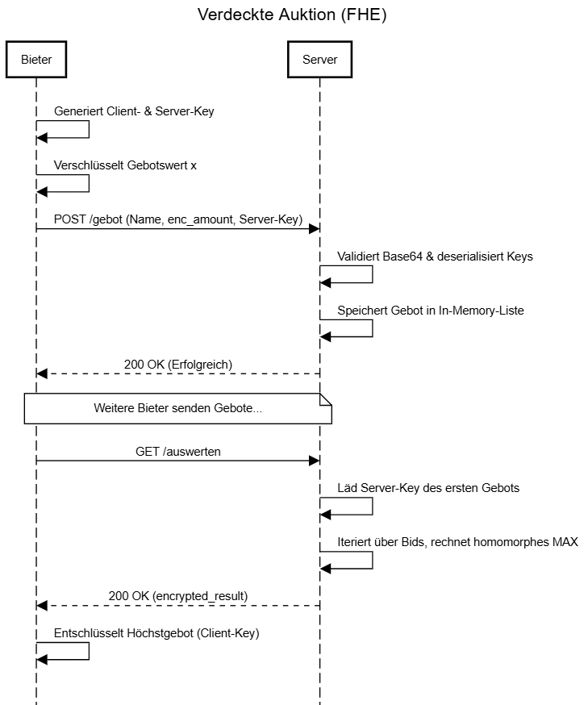

# Spezifikation

**für 04-sealed-bid-auction**

---

### Funktionsbeschreibung

Der Use Case Sealed-Bid Auction ermöglicht die Durchführung verdeckter Auktionen (Blindauktionen) zwischen mehreren Bietern. Ziel ist es, nach dem Ende der Bietphase den Höchstbietenden sowie den exakten Gewinnerbetrag zu ermitteln, ohne dass der Server zu irgendeinem Zeitpunkt die einzelnen Gebote der Teilnehmer im Klartext einsehen kann.

Hierzu werden die Gebotsbeträge bereits auf dem Client verschlüsselt und ausschließlich in verschlüsselter Form an das Backend übertragen. Das Backend verarbeitet und evaluiert die verschlüsselten Gebote mittels Fully Homomorphic Encryption (TFHE), ohne die zugrunde liegenden Klartexte kennen zu können. Die Entschlüsselung des finalen Auktionsgewinners ist ausschließlich durch den Besitzer des ClientKeys (den Auktionator) möglich.

#### Akteure:

- **Auktionator (Client E):**
  Der Auktionator initialisiert das TFHE-Schlüsselpaar, erstellt die Auktionsrunde und gibt die Auktion für die Bieter frei. Er besitzt den geheimen ClientKey und ist als einziger Akteur in der Lage, das vom Server homomorph berechnete Endergebnis (den Höchstbietenden und den Gewinnbetrag) lokal zu entschlüsseln.

- **Bieter (Client):**
  Ein Bieter kann der Auktion beitreten, indem er seinen Namen und sein verdecktes Gebot abgibt. Das Gebot wird clientseitig mit dem PublicKey als FheUint32 verschlüsselt. Bieter können zu keinem Zeitpunkt die Gebote anderer Teilnehmer oder den aktuellen Zwischenstand der Auktion einsehen.

- **Backend (Server):**
  Der Server verwaltet den Zustand der Auktion, speichert die eingehenden verschlüsselten Gebote flüchtig im RAM und stellt den PublicKey für neue Bieter bereit. Auf Anfrage führt er die rechenintensive, blinde Maximumsuche über homomorphe Größenvorzeichen-Operationen und Auswahlen durch, ohne Zugriff auf Klartextinformationen zu haben.

#### Lebenszyklus einer Session:

1. **Erstellung:** Der Auktionator generiert ein TFHE-Schlüsselpaar und startet die Auktion mit einer eindeutigen UUID. Der PublicKey und der komprimierte ServerKey werden an das Backend übergeben, der ClientKey verbleibt exklusiv im lokalen Session Storage des Auktionators.
2. **Gebotsabgabe:** Bieter rufen das Dashboard auf. Das Frontend lädt den PublicKey vom Server. Der Bieter gibt seinen Namen ein, das Frontend verschlüsselt den Betrag als `FheUint32` und sendet den Payload an `/auction/gebot`. Der Server speichert den Namen im Klartext und das Gebot als Ciphertext im globalen RAM (`Vec<Bid>`).
3. **Auswertung:** Sobald die Bietphase beendet ist, klickt der Auktionator on „Gewinner berechnen“. Der Server prüft, ob Gebote vorhanden sind, und durchläuft anschließend eine homomorphe Schleife, um das absolute Maximum und den zugehörigen Namen ohne Entschlüsselung zu isolieren. Das verschlüsselte Ergebnis wird für den Auktionator hinterlegt.
4. **Schließen & Finalisierung:** Nach der Auswertung wird die Auktion als geschlossen markiert. Es werden keine neuen Gebote mehr akzeptiert. Der Auktionator ruft das verschlüsselte Endergebnis ab, entschlüsselt es lokal mit seinem ClientKey und zeigt den Gewinner auf dem Dashboard an.

#### Verhaltensdiagramm

### 3.2 OpenAPI-Schnittstelle

Die API bietet zwei REST-Endpunkte, welche semantisch als Request/Response via JSON konzipiert sind. Die kryptographischen Payloads sind per `bincode` serialisiert und in Base64 codiert.

**POST `/gebot`**
Empfängt ein verschlüsseltes Gebot.

- **Request Body (JSON):**
  - `bidder_name` (String): Klartextname des Bieters.
  - `encrypted_amount` (String): Base64-codierter `tfhe::FheUint32` Payload.
  - `server_key` (String): Base64-codierter `tfhe::CompressedServerKey`.
- **Response (200 OK):**
  - `response` (String): Erfolgsmeldung.
- **Fehler (400 Bad Request):**
  - Tritt auf, wenn Base64 nicht decodiert werden kann oder die Deserialisierung in TFHE-Typen fehlschlägt. Rückgabe als String im Body.

**GET `/auswerten`**
Wertet die gespeicherten Gebote homomorph aus.

- **Response (200 OK):**
  - `status` (String): Meta-Information über die Anzahl der ausgewerteten Gebote.
  - `encrypted_result` (String): Base64-codierter `tfhe::FheUint32` Payload des höchsten Gebotes.
- **Fehler (400 Bad Request):**
  - Tritt auf, wenn die interne Gebotsliste leer ist.

### 3.3 Trust- und Threat-Model

| Datum / Element                 | Am Server klar | Am Server verschlüsselt | Nur am Client |
| :------------------------------ | :------------: | :---------------------: | :-----------: |
| Bieter-Name (`bidder_name`)     |       X        |                         |               |
| Gebotshöhe (`encrypted_amount`) |                |            X            |               |
| Max-Gebot (`encrypted_result`)  |                |            X            |               |
| Server-Key                      |       X        |                         |               |
| Client-Key                      |                |                         |       X       |

**Metadaten-Analyse:** Ein bösartiger Server-Operator kann die exakte Anzahl der Gebote, die Identitäten (Namen) der Teilnehmer und die genauen Zeitpunkte der Gebotsabgaben einsehen. Da FHE-Chiffrate für denselben Datentyp statische Größen aufweisen, sind Rückschlüsse auf die Höhe des Gebots durch Längenanalysen ausgeschlossen. Der Server-Operator könnte Traffic-Analysen fahren oder die Auswertung blockieren (Denial of Service).

**Restvertrauen & Garantien:** Es muss dem Server vertraut werden, dass er den Algorithmus korrekt anwendet. Ein manipulierender Server könnte willkürlich legitime Gebote aus der Liste entfernen (Zensur) oder das Resultat fälschen, indem er einfach das Chiffrat eines bevorzugten Bieters als Ergebnis zurückschickt, ohne die homomorphe Auswertung jemals durchgeführt zu haben. Schutzversprechen: Der Server lernt unter keinen Umständen die Höhe der eingereichten Gebote und auch nicht den Gewinner-Wert.

### 3.4 FHE-Designentscheidungen

- **Typen-Wahl:** Für die Gebotshöhen wird `FheUint32` verwendet. 32-Bit Unsigned Integer erlauben Gebote bis zu knapp 4,3 Milliarden, was für reale Auktionsszenarien absolut ausreichend ist. Der Typ ist deutlich performanter auszuwerten als `FheUint64`.
- **Operationen:** Zur Ermittlung des Höchstgebots werden ausschließlich der numerische Vergleich `.gt()` (Greater Than) und das Multiplexing `.select()` verwendet. Mathematische Operationen wie Addition oder Multiplikation sind hier nicht erforderlich.
- **Verworfene Varianten:** Die Sortierung der gesamten Liste wurde verworfen, da eine vollständige Sortierung in FHE aufgrund von datenunabhängigen Branches Komplexität aufbaut und nicht nötig ist. Stattdessen implementiert der Code ein lineares Scannen (Max-Suche), das den aktuellen Höchstwert überschreibt.

### 3.5 Komplexität der eigenen Algorithmen

Die Funktion `evaluate_encrypted_auction` iteriert über die Liste der eingegangenen Gebote. Sei $$n$$ die Anzahl der abgegebenen Gebote (wobei $$n \geq 1$$).

Der Algorithmus überspringt das erste Element und iteriert exakt $$n - 1$$ mal. Pro Iteration werden exakt zwei FHE-Operationen ausgeführt:

- Ein Vergleich (Greater Than): `gt()`
- Eine Auswahl (Mux): `select()`

Die asymptotische Laufzeit im Hinblick auf eigene FHE-Operationen beträgt damit exakt:

$$
\text{Komplexität} = \mathcal{O}(n)
$$

Der Platzbedarf während der Auswertung (zusätzlich zu den eingelesenen Chiffraten) ist $$\mathcal{O}(1)$$, da stets nur eine einzige Variable (`maximales_gebot`) für den Zwischenstand genutzt wird.

### 3.6 Performance-Messung

Die Performancemessung fand auf einem Netcup RS 1000 G9.5 statt, dem 2 vCores und 4 GB RAM zugewiesen wurden. Als Testdatensatz dienten Serienverschlüsselungen über ein automatisiertes Benchmark-Skript.

- **Latenzen:** Bei 10 sequentiellen Geboten beträgt die Auswertungs-Latenz (p50) auf dem Endpoint `/auswerten` ca. 2,83 Sekunden. Bei 50 Geboten steigt p95 auf ca. 14,15 Sekunden, was der streng linearen Skalierung ($\mathcal{O}(n)$) der homomorphen Schleife entspricht.
- **Speicherbedarf:** Während der Auswertung von 50 Bids werden ca. 120 MB RAM verbraucht, was primär auf das einmalige Laden des großen `CompressedServerKey` in den Arbeitsspeicher zurückzuführen ist.
- **Durchsatzgrenzen:** Wenn parallel mehrere `GET /auswerten`-Requests eintreffen (ab ca. 1 bis 2 Requests / Sekunde), gerät der Server ans CPU-Limit voreingestellter Threadpools. Da der globale Zustand über ein `state.lock()` (Mutex) während der gesamten FHE-Berechnung blockiert wird, entsteht bei parallelen Zugriffen ein massiver Verarbeitungsstau, der Timeouts (>30s) bei den Clients auslöst. Die Gebotsannahme (`POST /gebot`) ist hingegen nicht durch FHE-Operationen gebunden (die Ciphertexte werden lediglich als Bytes entgegengenommen und im RAM abgelegt) und skaliert im Bereich von Hunderten Requests pro Sekunde mühelos.

### 3.7 Limitationen

1. **Keine Auflösung des Gewinners:** Das System liefert ausschließlich den Betrag des höchsten Gebotes als Chiffrat zurück. Der Server kann fachlich nicht feststellen, hinter welchem `bidder_name` dieser Betrag steckte. Dem Bieter ist zwar das Max-Gebot nach Entschlüsselung bekannt; es existiert abseits von Off-Chain-Verifikationen jedoch aktuell kein kryptographischer Nachweis, der den Gewinner-Betrag mit dem einreichenden Namen verknüpft.
2. **Single-Key Assumption (Multi-Key FHE fehlt):** Die aktuelle Implementierung unterstellt im Code (`let real_sk_bytes = &liste[0].server_key_bytes;`), dass alle Bieter mit demselben gemeinsamen `ClientKey` verschlüsselt haben. Ein echtes verteiltes Trust-System, in dem jeder Bieter einen eigenen unabhängigen Key besitzt (Multi-Key FHE), ist nicht implementiert.
3. **Flüchtiger Speicherzustand:** Bids werden im Arbeitsspeicher über `static BIDS: Mutex<Vec<Bid>>` vorgehalten. Bei Container- oder Anwendungsneustarts ist die gesamte Auktion unwiederbringlich verloren.
4. **Fehlende Zugriffskontrolle:** Es gibt derzeit keinen Authentifizierungsmechanismus. Jeder Client kann beliebig viele Gebote übermitteln, und jeder kann die Endauswertung triggern. Spam- und DoS-Absicherung fehlt auf Service-Ebene.

---

## 4 Querschnittssektionen

### 4.1 Architektur-Übersicht

Das Projekt fungiert als monolythischer Axum-Webservice. Ein dediziertes Frontend bindet den Service direkt via REST (JSON + Base64) an. Die Architektur trennt den Transport-Layer (`auction.rs`) strikt von der FHE-Verarbeitungslogik (`logic.rs`).

Die "FHE-Grenze" befindet sich in `auction.rs` innerhalb der Request-Handler: Die von außen eingehenden Base64-Strings werden hier in Rust-Typen transformiert und in echten `tfhe`-Instanzen instanziiert. Die darunterliegende fachliche Ebene agiert rein auf Ciphertext-Objekten der TFHE-Bibliothek, ohne Berührungspunkte zum Netzwerkprotokoll zu haben.

### 4.2 Gateway und Routing

Das Routing basiert auf dem `axum`-Framework. Die Pfadzuordnung (Path-based Routing) erfolgt konventionell über einen dedizierten Server an Port 8080. Um den Transfer der teils immensen FHE-Schlüssel (Server_Key) zu gewährleisten, wurde das Standard-Limit von POST-Requests über die Middleware (`DefaultBodyLimit::max(2 * 1024 * 1024 * 1024)`) auf 2 GB angehoben. Das API-Handling ist durch `aide` / `openapi_docs` instrumentiert, was Swagger/OpenAPI-Dokumentation direkt aus der Router-Definition erzeugt. Authentifizierung oder Rate-Limiting am Gateway sind in diesem Stand nicht implementiert. Ein globaler CORS-Filter erlaubt momentan Anfragen aller Ursprünge (`Any`).

### 4.3 Key Lifecycle

- **Erzeugung:** Die Schlüsselgenerierung von `ClientKey` und `ServerKey` findet ausschließlich beim Client Anwendung.
- **Übertragung & Speicherung:** Da der Service statuslos arbeiten sollte, die FHE-Auswertung den Server-Schlüssel jedoch zwingend benötigt, muss dem Server ein `CompressedServerKey` gemeldet werden. Dieser wird dekomprimiert bereitgehalten. Aktuell sendet der Client den Key bei jedem POST-Request redundant mit, dieser wird auch im Hauptspeicher des Servers akkumuliert.
- **Verantwortlichkeit:** Fällt mit dem Neustart der Laufzeitumgebung der Status im Mutex, ist auch der Zugriff auf die referenzierten `ServerKeys` verloren. Sobald der Client seine Session verwirft oder seinen Key löscht, sind die Daten am Server de facto kryptographischer Müll.

### 4.4 Serialisierung

Die primäre Serialisierung für Netzwerkanfragen erfolgt über die JSON-Standards via `serde_json`. Die für die Sicherheit essentiellen homomorphen Daten (FHE-Variablen und Schlüssel) werden als interne Byte-Blobs über `bincode` serialisiert. Da JSON binäre Formate ohne Escaping nicht toleriert, werden die Bincode-Byte-Arrays über `base64` in Strings verpackt. Der `CompressedServerKey` beläuft sich in der hier genutzten TFHE-Parametrierung typischerweise auf mehr als 50 MB (abhängig vom exakten Parameter-Preset), weshalb die 2GB-Body-Grenze für die reibungslose Aufnahme existenzsichernd ist.

### 4.5 Build, Deployment, Tests

- **Tests:** Verifiziert wird der Code primär durch Integrationstests im Modul `auktion_tests.rs`. Hier wird ein kompletter Testdurchlauf gemmockt: Schlüssel in einem lokal geschützten `OnceLock`-Konstrukt vergeben, zwei Bieter gegeneinander ausgespielt und abschließend durch das System navigiert. Das Resultifikat wird mathematisch auf Korrektheit (`750 > 500`) hin evaluiert. Die fehlerfreie Abwehr von manipulierten Base64-Requests oder unvollständigen Auktionsauswertungen ist teildezidiert abgedeckt.
