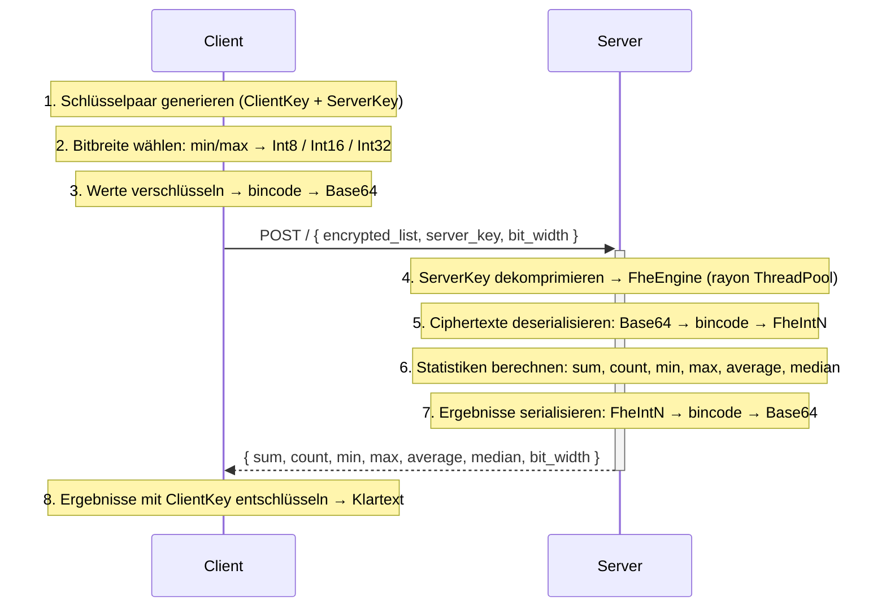

# Spezifikation
**für 05-encrypted-statistics-service**

---

### Funktionsbeschreibung

**Akteure:** Client (Browser, Angular-Frontend), Server (Axum/Rust-Service).

UC5 berechnet statistische Kennzahlen (Summe, Anzahl, Minimum, Maximum, Durchschnitt, Median) über eine Ganzzahlen-Liste, ohne dass der Server die Eingabewerte oder Ergebnisse jemals im Klartext sieht. Alle Berechnungen laufen vollständig auf verschlüsselten Daten.

**Ablauf eines Requests** (UC5 ist zustandslos — jeder Request ist in sich abgeschlossen):



---

### OpenAPI-Schnittstelle

#### `POST /`

Berechnet alle Statistiken für eine verschlüsselte Ganzzahlen-Liste.

**Request-Schema:**

```json
{
  "encrypted_list": [
    "<Base64-String>",
    "..."
  ],
  "server_key": "<Base64-String>",
  "bit_width": 8
}
```

| Feld             | Typ        | Beschreibung |
|------------------|------------|--------------|
| `encrypted_list` | `string[]` | Jedes Element: Base64(bincode(FheInt`N`)), wobei N = `bit_width`. Mindestens 1 Element. |
| `server_key`     | `string`   | Base64(bincode(CompressedServerKey)) — vom Client generiert, enthält kein Geheimnis. |
| `bit_width`      | `number`   | Muss 8, 16 oder 32 sein. Wird vom Client automatisch aus dem Wertebereich der Eingabe gewählt. |

**Response-Schema (200 OK):**

```json
{
  "sum":       "<Base64-String>",
  "count":     42,
  "min":       "<Base64-String>",
  "max":       "<Base64-String>",
  "average":   "<Base64-String>",
  "median":    "<Base64-String>",
  "bit_width": 8
}
```

| Feld        | Typ      | FHE-Typ (je nach `bit_width`)                               |
|-------------|----------|-------------------------------------------------------------|
| `sum`       | `string` | Base64(bincode(FheInt16/32/64)) — **eine Stufe breiter** als Eingabe |
| `count`     | `number` | Klartextzahl — dem Server schon aus dem Request bekannt      |
| `min`       | `string` | Base64(bincode(FheInt8/16/32)) — gleiche Breite wie Eingabe |
| `max`       | `string` | Base64(bincode(FheInt8/16/32)) — gleiche Breite wie Eingabe |
| `average`   | `string` | Base64(bincode(FheInt16/32/64)) — **eine Stufe breiter** als Eingabe |
| `median`    | `string` | Base64(bincode(FheInt8/16/32)) — gleiche Breite wie Eingabe |
| `bit_width` | `number` | Tatsächlich verwendete Bitbreite: 8, 16 oder 32             |

**Fehlerstatus:**

| Status | Bedeutung |
|--------|-----------|
| 400 Bad Request | Leere Liste, ungültiger Base64, falscher Ciphertext-Typ, ungültige `bit_width` |
| 500 Internal Server Error | Serialisierungsfehler beim Zusammenstellen der Response |

#### Weitere Endpunkte

| Endpunkt | Methode | Beschreibung |
|----------|---------|--------------|
| `/healthz` | GET | Liveness-Probe (Kubernetes) |
| `/readyz` | GET | Readiness-Probe (Kubernetes) |
| `/version` | GET | Service-Version als JSON |
| `/metrics` | GET | Prometheus-Metriken |
| `/docs` | GET | Swagger UI (OpenAPI-Dokumentation) |
| `/openapi.json` | GET | OpenAPI-Spec als JSON |

---

### Trust- und Threat-Model

**Was am Server bekannt ist:**

| Datum | am Server klar | am Server verschlüsselt | nur am Client |
|-------|:--------------:|:-----------------------:|:-------------:|
| Eingabewerte (die eigentlichen Zahlen) | ✗ | ✓ FheInt8/16/32 | Klartext vor Verschlüsselung |
| Anzahl der Elemente (n) | ✓ (Array-Länge im Request) | — | — |
| Wertebereich-Klasse | ✓ (über `bit_width`: Int8 → Werte in [-128, 127]) | — | — |
| Summe | ✗ | ✓ FheInt16/32/64 | nach Entschlüsselung |
| Minimum | ✗ | ✓ FheInt8/16/32 | nach Entschlüsselung |
| Maximum | ✗ | ✓ FheInt8/16/32 | nach Entschlüsselung |
| Durchschnitt | ✗ | ✓ FheInt16/32/64 | nach Entschlüsselung |
| Median | ✗ | ✓ FheInt8/16/32 | nach Entschlüsselung |
| ServerKey | ✓ (aus Request) | — | — |
| ClientKey | ✗ | — | ✓ verlässt den Browser nie |
| Anfragezeitpunkt | ✓ (HTTP-Timestamp) | — | — |
| Payload-Größe | ✓ (HTTP-Header) | — | — |

**Beobachtbare Metadaten und möglicher Missbrauch:**

- **Anzahl n** ist vollständig sichtbar. Ein Angreifer kann daraus schließen, wie viele Werte analysiert werden (z.B. „der Client hat genau 3 Werte geschickt" → möglicherweise 3 Messwerte eines Sensors).
- **bit_width** verrät die Größenordnung: `bit_width=8` bedeutet, alle Werte liegen in [-128, 127]. Das schränkt den möglichen Werteraum erheblich ein — bei kleinen Eingabelisten und bekanntem Kontext könnten Werte erraten werden.
- **Request-Timing** ist bei bekannten n-Werten korrelierbar. Die Berechnungsdauer hängt von n und bit_width ab, nicht von den konkreten Werten — es gibt kein datenwertabhängiges Timing-Leak.
- **Payload-Größe** ist deterministisch aus n und bit_width ableitbar (alle FHE-Ciphertexte haben bei gleichen TFHE-Parametern konstante Größe). Kein zusätzlicher Informationsgewinn.

**Restvertrauen in den Server-Operator:**

Der Server muss die Berechnungen korrekt ausführen. Ein böswilliger Server könnte:
- Falsche verschlüsselte Ergebnisse zurückgeben (der Client kann das nicht verifizieren — kein ZKP).
- Die Ciphertexte dauerhaft speichern (für einen hypothetischen späteren Kryptangriff).
- Den Request einfach ablehnen (Denial of Service).

**Annahmen außerhalb von FHE:**

- TLS zwischen Client und Server (kein Mitlesen im Transit).
- Das Angular-Frontend und der Browser sind nicht kompromittiert (ClientKey liegt im WASM-Speicher).
- TFHE-rs wird als korrekte Blackbox behandelt — keine eigene Kryptanalyse.
- Kein Auth-Gateway: jeder kann beliebige Requests an `POST /` schicken.

**Sicherheitsgarantie:**

Der Server kennt die statistischen Kennzahlen der Eingabewerte nicht — er berechnet sie, ohne sie je zu sehen. Bekannt sind ihm nur die Anzahl der Werte und der grobe Wertebereich (über `bit_width`). Keine ZKP-Verifikation der Ciphertexte und keine Client-Authentifizierung — beides ist im Rahmen dieses Use Cases nicht vorgesehen.

---

### FHE-Designentscheidungen

**Verwendete TFHE-rs-Typen:**

| Eingabe-Bitbreite | Eingabe-Typ | Summe/Avg-Typ | Begründung |
|:-----------------:|:-----------:|:-------------:|------------|
| 8 | FheInt8 | FheInt16 | Overflow-Schutz: n × 127 muss in den Output-Typ passen |
| 16 | FheInt16 | FheInt32 | Gleiche Logik, nächste Ebene |
| 32 | FheInt32 | FheInt64 | Int64 deckt alle realistischen Summen ab |

**Auto-Bitbreiten-Wahl (Client-seitig):**

Der Client bestimmt anhand von `min` und `max` der Eingabe die kleinste ausreichende Bitbreite:
- Int8 wenn min ≥ −128 und max ≤ 127
- Int16 wenn min ≥ −32.768 und max ≤ 32.767
- Int32 sonst

Der Server benötigt `bit_width` zwingend, um den richtigen FHE-Typ für die Deserialisierung zu wählen — `FheInt8`, `FheInt16` und `FheInt32` sind binär inkompatibel. Das Feld ist daher keine optionale Optimierung, sondern technisch notwendig.

Kleinere Bitbreiten reduzieren die Berechnungszeit deutlich, da die TFHE-Kosten mit der Bitbreite skalieren.

**Verwendete FHE-Operationen:**

| Operation | Verwendet für | Kosten |
|-----------|---------------|--------|
| `CastInto` | Up-Cast InputType → WiderOutputType vor Summation | günstig |
| `Add` | Summation (parallel via rayon) | moderat |
| `FheOrd` (lt/gt) | Vergleich in min/max und compare_and_swap | teuer (Bootstrapping) |
| `IfThenElse` auf FheBool | Wählt das Ergebnis homomorph aus, ohne den Wert zu kennen | moderat |
| Division durch Klartextskalar | Durchschnitt: `sum / (n as i16/i32/i64)` | deutlich günstiger als FHE-Division |

**Verworfene Varianten:**

- **Float (f32/f64):** Semantisch passend für Durchschnitt, aber TFHE-rs bietet keine Float-Typen.
- **Vollständig homomorphe Division:** TFHE-rs hat keine generische `Div<FheInt>`-Implementierung. Division durch einen Klartextwert ist hier ausreichend, weil die Listenlänge dem Server ohnehin bekannt ist.
- **Naiver sequentieller Sortieralgorithmus für Median:** Bubblesort wäre O(n²) Komparatoren und vollständig sequentiell — auf FHE-Niveau unakzeptabel. Das Batcher-Netzwerk ist datenunabhängig (keine Branches auf Plaintext-Vergleichsergebnissen) und hat O(log²n) Tiefe.
- **Partielles Sortiernetz (Median-optimiert):** Ein Netz, das nur den Median-Index isoliert berechnet, würde weniger Komparatoren brauchen. Nicht umgesetzt, weil der Aufwand für das UC-Projekt nicht gerechtfertigt ist.

---

### Komplexität der eigenen Algorithmen

Parameter: n = Anzahl der Eingabeelemente.
Eine einzelne homomorphe Operation gilt als O(1)-Baustein.

**sum:** Paralleles Reduce (rayon) auf n Elementen.
- Tiefe: O(log n) sequentielle Schritte (binärer Reduktionsbaum)
- Gesamtoperationen: n−1 Additionen
- Speicher: O(n)

**count:** O(1) — nur `slice::len()`.

**min / max:** Identisch zu `sum` (Reduce mit Vergleich statt Addition).
- Tiefe: O(log n)
- Gesamtoperationen: n−1 Vergleiche + n−1 if_then_else

**average:** O(log n) — identisch zu `sum`, plus eine O(1)-Division durch Klartextskalar.

**median (Batcher Odd-Even Mergesort):**

Das Batcher-Netzwerk für n Elemente hat (Herleitung: Knuth TAOCP Vol. 3, §5.3.4):
- **Tiefe** (Anzahl sequentieller Runden): O(log²n), exakt ½ · log₂(n) · (log₂(n)+1) für n = 2^k
- **Gesamtanzahl Komparatoren:** O(n log²n)

Innerhalb einer Runde laufen alle Komparatoren parallel (rayon). Die Wandzeit entspricht der Netzwerk-Tiefe: **O(log²n) sequentielle FHE-Runden.**

Jeder Komparator besteht aus: 1 × FheOrd-Vergleich + 2 × IfThenElse = O(1) homomorphe Operationen.

Gesamtspeicher: O(n) (der `partially_sorted`-Vektor als Arbeitspuffer).

---

### Performance-Messung

Messbedingungen: lokaler Entwicklungs-PC (Windows/WSL2), Rust release build, 1 Client, keine parallelen Requests.

| n | bit_width | Gesamtlatenz (Einzelmessung) | Anmerkung |
|---|-----------|------------------------------|-----------|
| 6 | 8 | ~18,9 s | Werte: −5, 3, 7, 5, 33, 10 |

**Netcup-Server-Messungen (p50/p95 unter Last): ausstehend.** Mess-Setup, Lastkurve und Throughput-Grenze sind für die finale Ausarbeitung noch zu erheben.

**Bekannte Performance-Treiber:**

- **ServerKey-Dekomprimierung:** `CompressedServerKey::decompress()` wird bei jedem Request neu durchgeführt — kein Caching. Das ist der größte einzelne Overhead neben der eigentlichen FHE-Berechnung.
- **FheOrd-Vergleiche** sind die teuersten Einzeloperationen (Bootstrapping-Kosten).
- **Rayon-Parallelisierung** innerhalb einer Batcher-Runde skaliert mit den CPU-Kernen des Servers.
- **Skalierung mit n:** Verdopplung von n erhöht die Batcher-Tiefe um ca. 2 · log₂n Runden. Der Sprung von n=6 auf n=12 erhöht die Tiefe von ~9 auf ~16 Runden.

---

### Limitationen

**Typsystem:** TFHE-rs unterstützt keine Float-Typen — alle Berechnungen sind auf i8/i16/i32 beschränkt. Der Durchschnitt ist eine ganzzahlige Truncation toward zero (`[1, 2]` → `1`, nicht `1,5`).

**Privacy-Einschränkungen:** Die Listenlänge ist aus dem Request direkt ablesbar; `bit_width` verrät zusätzlich die Größenordnung der Werte (`bit_width=8` → alle Werte in [-128, 127]). Beides lässt sich durch Padding bzw. uniforme Bitbreite abmildern — für diesen Use Case nicht umgesetzt, da der Mehraufwand die Performance deutlich verschlechtern würde.

**Keine Verifikation der Eingaben:** Der Server kann nicht prüfen, ob der Client korrekte FHE-Ciphertexte schickt — kein ZKP, keine Authentifizierung. Bei öffentlicher Erreichbarkeit sind Missbrauch durch Masse-Requests (teurer Rechenaufwand) und manipulierte Ciphertexte möglich.

**Performance:** Kein Session-Caching — `CompressedServerKey::decompress()` läuft bei jedem Request neu. Bei n > ~20 mit Int32 übersteigt die Rechenzeit mehrere Minuten; der Service ist für kleine Listen (n ≤ ~15) konzipiert. Der Batcher-Algorithmus sortiert außerdem die gesamte Liste, statt nur den Median-Index zu isolieren.
