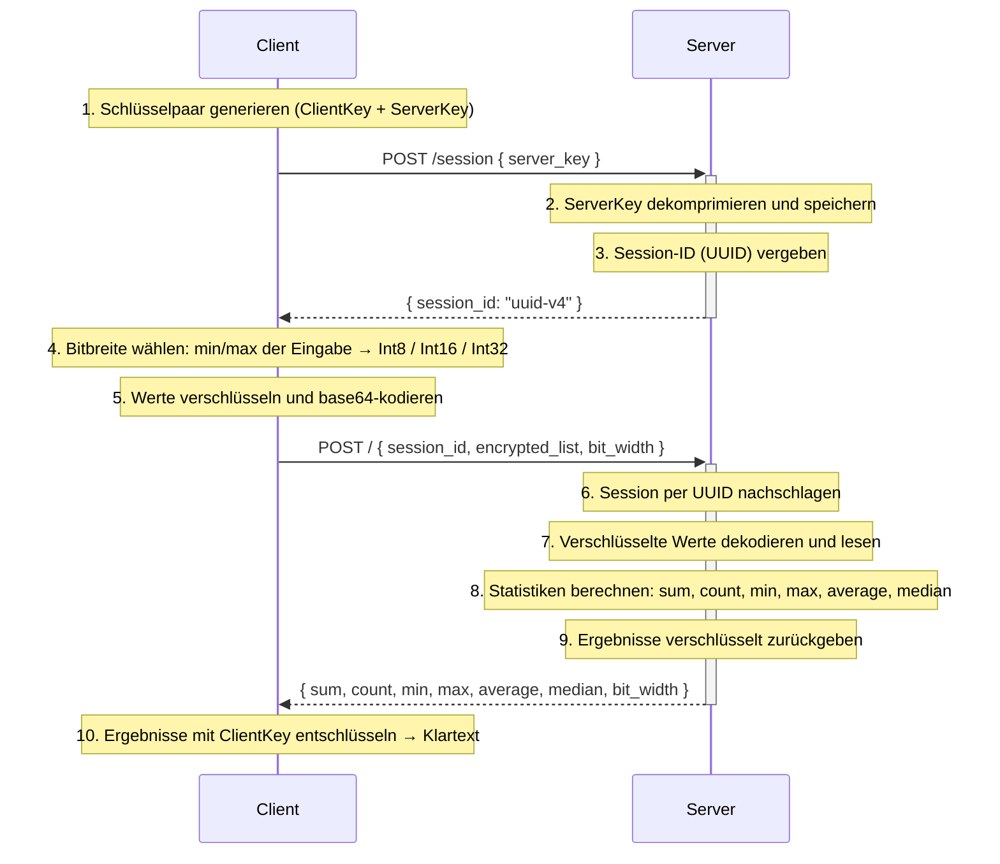

# Spezifikation
**für 05-encrypted-statistics-service**

---

### Funktionsbeschreibung

Der Use Case Encrypted Statistics Service berechnet statistische Kennzahlen (Summe, Anzahl, Minimum, Maximum, Durchschnitt, Median) über eine Ganzzahlen-Liste, ohne dass der Server die Eingabewerte oder Ergebnisse jemals im Klartext sieht. Alle Berechnungen laufen vollständig auf verschlüsselten Daten.

Der ServerKey (~80 MB) wird einmalig via `POST /session` hochgeladen und einer UUID zugewiesen. Folgende Berechnungsrequests (`POST /`) senden nur die UUID — kein Key-Overhead pro Request.

#### Akteure

- **Client** (Browser, Angular-Frontend): Generiert das TFHE-Schlüsselpaar, verschlüsselt die Eingabewerte mit dem `ClientKey` und lädt den `ServerKey` einmalig via `POST /session` hoch. Der `ClientKey` verlässt den Browser nie — nur der Client kann die Ergebnisse entschlüsseln.

- **Server** (Axum/Rust-Service): Empfängt den `ServerKey` einmalig, dekomprimiert ihn und speichert ihn pro Session. Alle folgenden Berechnungsrequests nutzen die gecachte Engine. Der Server sieht zu keinem Zeitpunkt Eingabewerte oder Ergebnisse im Klartext.

#### Ablauf



---

### OpenAPI-Schnittstelle

Alle FHE-Werte (verschlüsselte Zahlen und Keys) werden als `string` übertragen: bincode-serialisiert und base64-kodiert.

#### `POST /session`

Lädt den ServerKey einmalig hoch und gibt eine Session-UUID zurück. Alle folgenden Berechnungsrequests nutzen nur noch die UUID.

**Request-Schema:**

```json
{
  "server_key": "<Base64-String>"
}
```

| Feld         | Typ      | Beschreibung |
|--------------|----------|--------------|
| `server_key` | `string` | Der vom Client generierte ServerKey, base64-kodiert. |

**Response-Schema (200 OK):**

```json
{
  "session_id": "550e8400-e29b-41d4-a716-446655440000"
}
```

#### `POST /`

Berechnet alle Statistiken für eine verschlüsselte Ganzzahlen-Liste.

**Request-Schema:**

```json
{
  "session_id":     "550e8400-e29b-41d4-a716-446655440000",
  "encrypted_list": ["<Base64-String>", "..."],
  "bit_width":      8
}
```

| Feld             | Typ        | Beschreibung |
|------------------|------------|--------------|
| `session_id`     | `string`   | UUID aus `POST /session`. |
| `encrypted_list` | `string[]` | Verschlüsselte Eingabewerte, base64-kodiert. Mindestens 1 Element. Typ je nach `bit_width`: FheInt8, FheInt16 oder FheInt32. |
| `bit_width`      | `number`   | Bitbreite der Eingabewerte: 8, 16 oder 32. Wird vom Client anhand des Wertebereichs der Eingabe gewählt. |

**Response-Schema (200 OK):**

```json
{
  "sum":       "<Base64-String>",
  "count":     42,
  "min":       "<Base64-String>",
  "max":       "<Base64-String>",
  "average":   "<Base64-String>",
  "median":    "<Base64-String>",
  "bit_width": 8
}
```

| Feld        | Typ      | Beschreibung |
|-------------|----------|--------------|
| `sum`       | `string` | Verschlüsselte Summe — **eine Bitbreite breiter** als die Eingabe (Overflow-Schutz). |
| `count`     | `number` | Anzahl der Elemente — Klartext, da dem Server aus dem Request bekannt. |
| `min`       | `string` | Verschlüsseltes Minimum — gleiche Bitbreite wie die Eingabe. |
| `max`       | `string` | Verschlüsseltes Maximum — gleiche Bitbreite wie die Eingabe. |
| `average`   | `string` | Verschlüsselter Durchschnitt — **eine Bitbreite breiter** als die Eingabe (Overflow-Schutz). |
| `median`    | `string` | Verschlüsselter Median — gleiche Bitbreite wie die Eingabe. |
| `bit_width` | `number` | Tatsächlich verwendete Bitbreite: 8, 16 oder 32. |

**Fehlerstatus:**

| Status | Bedeutung |
|--------|-----------|
| 400 Bad Request | Leere Liste, ungültiger Base64, falscher Ciphertext-Typ, ungültige `bit_width` |
| 404 Not Found | Session nicht gefunden oder abgelaufen (Idle-Timeout 10 min) |
| 500 Internal Server Error | Serialisierungsfehler beim Zusammenstellen der Response |

#### Weitere Endpunkte

| Endpunkt | Methode | Beschreibung |
|----------|---------|--------------|
| `/healthz` | GET | Liveness-Probe (Kubernetes) |
| `/readyz` | GET | Readiness-Probe (Kubernetes) |
| `/version` | GET | Service-Version als JSON |
| `/metrics` | GET | Prometheus-Metriken |
| `/docs` | GET | Swagger UI (OpenAPI-Dokumentation) |
| `/openapi.json` | GET | OpenAPI-Spec als JSON |

---

### Trust- und Threat-Model

**Was am Server bekannt ist:**

| Datum | am Server klar | am Server verschlüsselt | nur am Client |
|-------|:--------------:|:-----------------------:|:-------------:|
| Eingabewerte (die eigentlichen Zahlen) | ✗ | ✓ FheInt8/16/32 | Klartext vor Verschlüsselung |
| Anzahl der Elemente (n) | ✓ (Array-Länge im Request) | — | — |
| Wertebereich-Klasse | ✓ (über `bit_width`: Int8 → Werte in [-128, 127]) | — | — |
| Summe | ✗ | ✓ FheInt16/32/64 | nach Entschlüsselung |
| Minimum | ✗ | ✓ FheInt8/16/32 | nach Entschlüsselung |
| Maximum | ✗ | ✓ FheInt8/16/32 | nach Entschlüsselung |
| Durchschnitt | ✗ | ✓ FheInt16/32/64 | nach Entschlüsselung |
| Median | ✗ | ✓ FheInt8/16/32 | nach Entschlüsselung |
| ServerKey | ✓ (einmalig via POST /session) | — | — |
| ClientKey | ✗ | — | ✓ verlässt den Browser nie |
| Anfragezeitpunkt | ✓ (HTTP-Timestamp) | — | — |
| Payload-Größe | ✓ (HTTP-Header) | — | — |

#### Analyse: Beobachtbare Metadaten

TFHE schützt ausschließlich den Inhalt der Eingabewerte und Ergebnisse. Für den Server bleiben weiterhin verschiedene Metadaten sichtbar:

- **Anzahl n** ist sichtbar. Daraus lässt sich schließen, wie viele Werte analysiert werden (z.B. „3 Werte → möglicherweise 3 Sensormesswerte").
- **bit_width** verrät den Wertebereich: `bit_width=8` bedeutet, alle Werte liegen in [-128, 127]. Bei kleinen Listen und bekanntem Kontext könnten Werte erraten werden.
- **Request-Timing** hängt von n und bit_width ab, nicht von den konkreten Werten — kein datenwertabhängiges Timing-Leak.
- **Payload-Größe** lässt sich direkt aus n und bit_width berechnen (alle FHE-Ciphertexte haben konstante Größe). Kein zusätzlicher Informationsgewinn.

#### Restvertrauen in den Server

Der Server kann zwar die Eingabewerte nicht entschlüsseln, muss jedoch weiterhin als korrekter Ausführer der Berechnungslogik vertrauenswürdig sein. Insbesondere wird angenommen, dass der Server:

- alle Statistiken korrekt und unverändert berechnet (kein Austausch gegen eine Funktion, die konstante Werte zurückgibt)
- die korrekten verschlüsselten Ergebnisse zurücksendet und sie nicht durch manipulierte Ciphertexte ersetzt
- den ServerKey nicht persistiert oder weitergibt
- Sessions voneinander trennt

TFHE reduziert somit die Vertrauensabhängigkeit hinsichtlich der Inhaltsvertraulichkeit, ersetzt jedoch kein vollständig vertrauensloses Protokoll.

#### Annahmen außerhalb von TFHE

Die Sicherheitsbetrachtung basiert auf folgenden Annahmen:

- Die Kommunikation zwischen Client und Server erfolgt über TLS.
- Das Angular-Frontend und der Browser sind nicht kompromittiert (ClientKey liegt im WASM-Speicher).
- Die verwendete TFHE-rs-Bibliothek wird als kryptographisch korrekt implementierte Black Box betrachtet.
- Es gibt keine Authentifizierung am Endpunkt: jeder kann Requests an `POST /session` und `POST /` schicken.

#### Schutzversprechen

Durch den Einsatz von TFHE wird garantiert:

- Der Server kann die Eingabewerte nicht im Klartext lesen.
- Der Server kann die berechneten Statistiken nicht im Klartext lesen.
- Alle Berechnungen werden ausschließlich auf verschlüsselten Daten durchgeführt.

Nicht garantiert werden:

- Schutz vor einem Server, der korrekte Berechnungen durch manipulierte Ergebnisse ersetzt
- Vertraulichkeit von Metadaten (Listenlänge n, Wertebereich über bit_width, Request-Timing)
- Authentizität der Ciphertexte (kein ZKP, keine Client-Authentifizierung)

> *„Der Server kennt die Eingabewerte nicht. Er sieht nur Ciphertexte, addiert und vergleicht sie ohne je einen Klartext zu sehen, und gibt alle Statistiken verschlüsselt zurück. Nur der Client kann die Ergebnisse mit seinem ClientKey entschlüsseln."*

Diese Garantie hält gegen einen Operator, der das Protokoll korrekt ausführt, aber Metadaten beobachtet. Gegen einen aktiv manipulierenden Operator hält sie nicht.

---

### FHE-Designentscheidungen

#### Verwendete TFHE-rs-Typen

Summe und Durchschnitt werden in einem breiteren Typ berechnet, um Overflow zu vermeiden (z.B. 10 Werte à 127 = 1270 — passt nicht in Int8).

| Eingabe-Bitbreite | Eingabe-Typ | Summe/Avg-Typ |
|:-----------------:|:-----------:|:-------------:|
| 8 | FheInt8 | FheInt16 |
| 16 | FheInt16 | FheInt32 |
| 32 | FheInt32 | FheInt64 |

#### Bitbreite wählen

Der Client wählt die kleinste Bitbreite, die den Wertebereich der Eingabe abdeckt:
- Int8 wenn min ≥ −128 und max ≤ 127
- Int16 wenn min ≥ −32.768 und max ≤ 32.767
- Int32 sonst

Der Server braucht `bit_width` zwingend, weil `FheInt8`, `FheInt16` und `FheInt32` nicht austauschbar sind — ein falsch angenommener Typ führt zu einem Deserialisierungsfehler.

Kleinere Bitbreiten sind deutlich schneller, da die TFHE-Rechenkosten mit der Bitbreite steigen.

#### Verwendete homomorphe Operationen

| Operation | Verwendet für | Kosten |
|-----------|---------------|--------|
| Typumwandlung zu breiterem Typ | Vor Summation (Overflow-Schutz) | günstig |
| `Add` | Summe berechnen | moderat |
| `FheOrd` (lt/gt) | Vergleiche für min, max, Median | teuer (erfordert Bootstrapping) |
| `IfThenElse` | Ergebnis homomorph auswählen, ohne den Wert zu kennen | moderat |
| Division durch Klartextskalar | Durchschnitt: Summe ÷ Anzahl | günstig — Anzahl ist dem Server bekannt |

#### Verworfene Alternativen

<u>Float (f32/f64)</u>

Wäre für Durchschnitt sinnvoll, aber TFHE-rs unterstützt keine Float-Typen.

<u>FHE-Division</u>

TFHE-rs unterstützt keine Division zweier verschlüsselter Zahlen. Division durch einen Klartextwert (die Anzahl) ist hier ausreichend, da die Listenlänge dem Server ohnehin bekannt ist.

<u>Sequentielle Sortierung für Median</u>

Bubblesort wäre O(n²) und vollständig sequentiell — bei FHE nicht akzeptabel. Das Batcher-Netzwerk vergleicht in fester Reihenfolge ohne Verzweigungen, was bei FHE zwingend ist: der Server darf keine Vergleichsergebnisse sehen.

<u>Partielles Sortiernetz (nur Median)</u>

Würde weniger Vergleiche benötigen als das vollständige Batcher-Netzwerk, wurde aber nicht umgesetzt — der Aufwand ist im Rahmen dieses Projekts nicht gerechtfertigt.

<u>Key pro Request (zustandsloses Design)</u>

Das ursprüngliche Design sendete den ~80 MB ServerKey mit jedem Request. Bei 15 Requests waren das ~1,2 GB Traffic und 50 % Fehlerrate unter Last, weil Nginx nach 60 s abbricht. Ersetzt durch Session-Caching.

---

### Komplexität der eigenen Algorithmen

Parameter: n = Anzahl der Eingabeelemente. Jede FHE-Operation zählt als O(1).

**sum:** Paralleles Zusammenrechnen über n Elemente.
- Tiefe: O(log n) sequentielle Schritte
- Gesamtoperationen: n−1 Additionen
- Speicher: O(n)

**count:** O(1) — nur die Array-Länge auslesen.

**min / max:** Gleicher Ablauf wie `sum`, aber mit Vergleich statt Addition.
- Tiefe: O(log n)
- Gesamtoperationen: n−1 Vergleiche + n−1 IfThenElse

**average:** O(log n) — identisch zu `sum`, plus eine O(1)-Division durch die Anzahl (Klartext).

**median (Batcher Odd-Even Mergesort):**

Das Batcher-Netzwerk sortiert die Liste in Runden. In jeder Runde laufen alle Vergleiche parallel. (Herleitung: Knuth TAOCP Vol. 3, §5.3.4)

- **Tiefe** (Anzahl sequentieller Runden): O(log²n) — exakt ½ · log₂(n) · (log₂(n)+1) für n = 2^k
- **Gesamtanzahl Vergleiche:** O(n log²n)

Jeder Vergleich besteht aus: 1 × FheOrd-Vergleich + 2 × IfThenElse.

Gesamtspeicher: O(n).

---

### Performance-Messung

**Mess-Setup:**

- Tool: k6 v2.0.0
- TFHE: `ConfigBuilder::default()`
- Datum: 09.06.2026
- Server: Netcup KVM
- Last injiziert von lokaler Windows-Maschine über das Internet

#### Test 1 — Baseline (1 VU, 5 Iterationen, alle Bitbreiten)

| Konfiguration | p95 Latenz | Fehlerrate |
|---------------|-----------|------------|
| n=5, bit_width=8 | 2,23 s | 0 % |
| n=10, bit_width=8 | 4,46 s | 0 % |
| n=10, bit_width=16 | 7,95 s | 0 % |
| n=10, bit_width=32 | 16,16 s | 0 % |
| **Gesamt** | — | **0 % (20/20 Requests)** |

Gesendete Datenmenge: **113 MB** — der ServerKey wird einmalig hochgeladen, alle weiteren Requests enthalten nur die verschlüsselten Werte. Ohne Session-Caching wären für die gleiche Anzahl Requests ~1,2 GB übertragen worden.

*Fazit:* Bei einem Client läuft der Service fehlerfrei über alle Bitbreiten. Die Latenz hängt ausschließlich von der FHE-Berechnung ab — der Key-Upload-Overhead der alten API entfällt vollständig.

#### Test 2 — Stresstest (ramping bis 10 VUs, 6 Minuten)

Lastkurve: 60 s → 1 VU, 90 s → 3 VUs, 90 s → 6 VUs, 90 s → 10 VUs, 30 s → 0 VUs.

| Metrik | Wert |
|--------|------|
| Fehlerrate gesamt | 52 % (77/149 Requests) |
| Erfolgreiche Requests | 48 % (71/148 Iterationen) |
| p95 Latenz (erfolgreiche Requests) | 18,77 s |
| Fehler starten ab | ~108 s (≈ 2–3 parallele VUs) |
| Fehlertyp | HTTP 502 Bad Gateway (Nginx-Timeout nach 60 s) |

*Fazit:* Ab ca. 2–3 parallelen Clients reicht die CPU nicht mehr aus, um alle Requests innerhalb des Nginx-Timeouts (60 s) zu beantworten. Der Engpass ist rein CPU-seitig — nicht mehr der Netzwerk-Overhead wie im alten Design.

UC5 ist der rechenaufwendigste Use Case im Projekt: 6 Statistiken gleichzeitig, mit O(log²n) Tiefe im Batcher-Algorithmus. Zum Vergleich: UC2 (Age Verification) führt nur 2 FHE-Vergleiche aus und erreicht trotzdem 30 % Fehlerrate unter gleicher Last. UC3 (Voting) verwendet nur FHE-Additionen, die deutlich günstiger sind, und hat keine Lasttests. UC9 (Program Execution) ist nicht implementiert.

**Performance-Treiber:**

- **FheOrd-Vergleiche** sind die teuersten Einzeloperationen — sie dominieren Median, min und max.
- **Parallelisierung** innerhalb einer Batcher-Runde: alle Vergleiche einer Runde laufen gleichzeitig und skalieren mit der Anzahl der CPU-Kerne.
- **Skalierung mit n:** Verdopplung von n erhöht die Batcher-Tiefe um ca. 2 · log₂n Runden. Der Sprung von n=6 auf n=12 erhöht die Tiefe von ~9 auf ~16 Runden.
- **Session-Caching:** Der ServerKey wird einmalig pro Session dekomprimiert. Nicht genutzte Sessions werden nach 10 Minuten automatisch gelöscht, um Speicher freizugeben.

#### Reproduzierbarkeit

Die k6-Skripte liegen unter `services/05-encrypted-statistics-service/src/Load-Tests/`. Vor dem ersten Lauf muss ein Payload generiert werden:

```bash
# Payload generieren (einmalig, aus Repo-Root)
cargo run --release -p encrypted-statistics-service --bin gen_payload

# Tests ausführen (Windows PowerShell, aus Repo-Root)
cd services\05-encrypted-statistics-service\src\Load-Tests
k6 run baseline_load_test.js
k6 run stress_load_test.js
```

---

### Limitationen

- Kein Float-Support: TFHE-rs unterstützt keine Float-Typen — alle Berechnungen sind auf ganzzahlige Typen beschränkt. Der Durchschnitt ist ganzzahlig — Nachkommastellen werden abgeschnitten (`[1, 2]` → `1`, nicht `1,5`).

- Sichtbare Metadaten: Die Listenlänge ist direkt aus dem Request ablesbar. `bit_width` verrät zusätzlich den Wertebereich der Eingabe. Beides ließe sich durch Padding oder eine feste Bitbreite verstecken — für diesen Use Case nicht umgesetzt, da es die Performance deutlich verschlechtern würde.

- Keine Eingabevalidierung: Der Server kann nicht prüfen, ob der Client korrekte FHE-Ciphertexte schickt — kein ZKP, keine Authentifizierung. Bei öffentlichem Zugang sind viele Anfragen möglich, die teure Rechenzeit binden.

- Listengröße: Bei n > ~20 mit Int32 dauert die Berechnung mehrere Minuten. Der Service ist für kleine Listen (n ≤ ~15) ausgelegt. Der Batcher-Algorithmus sortiert außerdem die gesamte Liste, statt nur den Median zu isolieren — das ist mehr Arbeit als nötig, wurde aber nicht optimiert.

- Session-Lebensdauer: Sessions laufen nach 10 Minuten Inaktivität ab. Wer danach noch einen Berechnungsrequest schickt, erhält 404 und muss den Key erneut hochladen.
