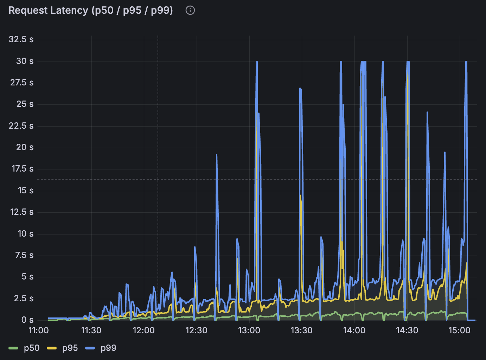

# Spezifikation
**für 08-encrypted-leaderboard**
> [!NOTE]
> Pro umgesetztem Use Case sind die folgenden acht Sektionen verpflichtend. Die Sektionsstruktur ist für alle UCs identisch; die Detailtiefe darf je nach UC-Komplexität variieren (UC2 wird hier zwangsläufig weniger Inhalt haben als UC9).
---

### Funktionsbeschreibung

Der Use Case Leaderboard ermöglicht eine vertrauliche Rangliste innerhalb kleiner Gruppen. Ziel ist es, die Reihenfolge der Spieler nach ihrem Score zu bestimmen, ohne dass der Server zu irgendeinem Zeitpunkt die einzelnen Scores im Klartext sieht.

Hierzu verschlüsseln die Spieler ihre Scores bereits auf dem Client und übertragen diesen ausschließlich in verschlüsselter Form an das Backend. Das Backend vergleicht die verschlüsselten Werte mittels Fully Homomorphic Encryption (TFHE) und sortiert die Liste in einem datenunabhängigen Sortiernetzwerk, ohne dabei zu erfahren, welcher Score höher oder niedriger ist. Die Entschlüsselung der sortierten Liste ist ausschließlich durch den Besitzer des ClientKeys möglich.

Eine Leaderboard-Session unterstützt bis zu 20 Spieler. Reicht derselbe Spieler später erneut einen Score ein, behält der Server verschlüsselt das Maximum aus altem und neuem Wert.

#### Akteure:

- **Ersteller (E):**
Der Ersteller generiert lokal das TFHE-Schlüsselmaterial (ClientKey, ServerKey, PublicKey), legt den Raum an und teilt den 6-stelligen Raumcode extern an die Spieler. Der ClientKey verbleibt ausschließlich bei E, nur ServerKey und PublicKey wandern zum Server. E ist der einzige Akteur, der die sortierte Liste am Ende entschlüsseln kann.

- **Spieler (Client):**
Ein Spieler tritt einem Raum bei, indem er den Raumcode eingibt. Beim ersten Beitritt wählt er einmalig einen Namen, der Client erzeugt im Hintergrund eine UUID und ein zufälliges ID-Byte und legt beides in `localStorage` ab. Der Spieler holt den PublicKey vom Server, verschlüsselt damit seinen Score und sein ID-Byte und sendet beides per Submit. Spieler sehen zu keinem Zeitpunkt die Score-Werte anderer Teilnehmer.

- **Backend (Server):**
Der Server verwaltet pro Raum eine Session mit dekomprimiertem ServerKey, der Liste verschlüsselter Einträge (Score + ID als Ciphertext) und einer sortierten Sicht. Er führt homomorphe Vergleiche aus, sortiert die Liste blind und hat zu keinem Zeitpunkt Zugriff auf Klartext-Scores.

#### Lebenszyklus einer Session:

1. **Raum anlegen:** Der Ersteller generiert das TFHE-Schlüsselpaar und ruft `POST /create` mit ServerKey und PublicKey auf. Der Server dekomprimiert den ServerKey einmalig im Hintergrund, legt eine Session an und gibt einen 6-stelligen Code zurück. Der ClientKey verbleibt ausschließlich beim Ersteller.
2. **Code teilen:** Der Ersteller gibt den Code out-of-band an seine Spieler weiter, also etwa per Chat oder mündlich. Es gibt keinen Einladungs-Endpoint, die Zulassung wird sozial geregelt.
3. **Namen wählen:** Beim ersten Beitritt zeigt der Spieler-Client einen einmaligen Name-Dialog (nur Buchstaben, 1 bis 20 Zeichen). Im Hintergrund werden eine UUID und ein zufälliges ID-Byte erzeugt. Beides wird in `localStorage` unter `lb_player_<code>` abgelegt. Bei einem späteren Beitritt in denselben Raum wird der Dialog übersprungen und die gespeicherte Identität wiederverwendet.
4. **Mitmachen:** Der Spieler ruft `GET /{code}/public-key` ab, verschlüsselt lokal seinen Score und sein ID-Byte und sendet beides per `POST /{code}/submit`. Als `player_key` geht das Klartext-Format `name:uuid` zum Backend, die UUID dient nur der Eindeutigkeit für die Wiedererkennung und wird nirgends im UI angezeigt. Reicht derselbe Spieler später erneut ein, behält der Server verschlüsselt das Maximum aus altem und neuem Score (`keep_max`).
5. **Sortieren:** Nach jedem Submit stößt der Server im Hintergrund eine Sortierung an (Batcher-Odd-Even-Mergesort). Pro Session läuft immer nur eine Sortierung gleichzeitig; weitere Submits während eines laufenden Sorts werden nach dessen Abschluss berücksichtigt.
6. **Ergebnis abrufen:** Der Ersteller ruft `GET /{code}/entries` ab. Die Response enthält zwei Listen: die sortierten Ciphertexte (Score und ID) und eine Klartext-Spielerliste mit `player_key` und `encrypted_id` pro Eintrag. Der Ersteller entschlüsselt jeden ID-Ciphertext lokal mit seinem ClientKey, baut daraus eine Tabelle `id-byte → name` und ordnet die Namen den sortierten Positionen zu. Optional fragt er über `POST /{code}/rank` die Position einer bestimmten ID ab und bekommt pro Listenplatz einen verschlüsselten Bool zurück.
7. **Schließen:** Es gibt keinen expliziten Schließen-Endpoint. Sessions werden vom Janitor nach 10 Minuten Inaktivität entfernt. Der Janitor ist ein Hintergrund-Task, der einmal pro Minute durch die Session-Map iteriert und alle Räume freigibt, an denen seit über 10 Minuten kein Request mehr eingegangen ist. Beim Entfernen wird der dekomprimierte ServerKey (mehrere hundert MB) freigegeben, andernfalls würde der Speicher volllaufen. Bei einem Server-Neustart gehen alle Sessions verloren; es gibt keine Persistenz.

#### Verhaltensdiagramm

```
E                          Server                          Spieler
│                             │                               │
│── POST /create ────────────►│                               │
│◄────── { code } ────────────│                               │
│                                                             │
│── Code per Chat (out-of-band) ─────────────────────────────►│
│                             │                               │
│                             │            [Name-Dialog, einmalig pro Raum]
│                             │            [localStorage: {name, uuid, id-byte}]
│                             │                               │
│                             │◄──── GET /public-key ─────────│
│                             │────── { public_key } ────────►│
│                             │                               │
│                             │◄──── POST /submit ────────────│
│                             │      player_key = name:uuid   │
│                             │ [keep_max + Hintergrund-Sort] │
│                             │◄──── POST /submit … ──────────│
│                             │                               │
│── GET /entries ────────────►│                               │
│◄── entries + Spielerliste ──│                               │
│                                                             │
│ E entschlüsselt jede ID, mappt Spielerliste → Namen pro Rang│
```

### OpenAPI-Schnittstelle

Der Service stellt eine fachliche Leaderboard-API unter dem Pfad-Prefix `/leaderboard` bereit, mit der Räume erstellt, verschlüsselte Scores eingereicht und sortierte Ergebnisse abgefragt werden können. Die OpenAPI-Definition wird per `aide` aus dem Code generiert und ist unter `GET /openapi.json` sowie `GET /docs` (Swagger UI) verfügbar. Daneben existieren `/healthz`, `/readyz`, `/version` und `/metrics` aus den shared Crates.

Das Body-Limit liegt bei 2 GiB (`DefaultBodyLimit::max(2*1024³)`), weil der komprimierte ServerKey je nach Parametern dreistellige Megabyte groß werden kann.

### POST /create

Legt einen neuen Leaderboard-Raum an. Der ServerKey wird einmalig dekomprimiert und in der Session gehalten, der PublicKey wird unverändert gespeichert und später an Spieler ausgeliefert.

#### Request
```json
{
  "server_key": "<base64(bincode(CompressedServerKey))>",
  "public_key": "<base64(bincode(CompactPublicKey))>"
}
```

#### Response 200
```json
{ "code": "847391" }
```

#### Fehlercodes
- 400 – `server_key` oder `public_key` kein gültiges Base64 oder fehlgeschlagene bincode-Deserialisierung
- 500 – Panic im Dekomprimierungs-Thread

### GET /{code}/public-key

Gibt den PublicKey des Raums unverändert zurück, so wie er beim Anlegen hochgeladen wurde. Spieler nutzen ihn, um ihre Scores zu verschlüsseln.

#### Response 200
```json
{ "public_key": "<base64>" }
```

#### Fehlercodes
- 404 – Raum nicht gefunden oder bereits vom Janitor entfernt

### POST /{code}/submit

Ein Spieler reicht seinen verschlüsselten Score ein. Bei einem Re-Submit desselben `player_key` führt der Server `keep_max` aus und behält verschlüsselt das Maximum aus altem und neuem Score.

#### Request
```json
{
  "player_key": "Alice:550e8400-e29b-41d4-a716-446655440000",
  "encrypted_score": "<base64(bincode(FheUint16))>",
  "encrypted_id":    "<base64(bincode(FheUint8))>"
}
```
- `player_key` ist Klartext im Format `name:uuid`. Der Server nutzt den vollständigen String als Wiedererkennungs-Schlüssel, sodass ein erneutes Einreichen derselben Identität ein `keep_max` auslöst. Die UUID sorgt für Eindeutigkeit, falls mehrere Spieler denselben Namen wählen, und wird nirgends im UI angezeigt.
- `encrypted_score` ist ein `FheUint16` (Score zwischen 0 und 65535).
- `encrypted_id` ist ein `FheUint8`, ein zufälliges ID-Byte (0 bis 255), das der Client pro Raum einmalig erzeugt. Es wandert zusammen mit dem Score durch den FHE-Sort und dient dem Ersteller später als Klartext-Label, um die sortierte Liste auf Namen zu mappen.

#### Response 200
Leerer Body.

#### Fehlercodes
- 400 – ungültiges Base64 oder fehlgeschlagene bincode-Deserialisierung
- 404 – Raum nicht gefunden
- 409 – Raum voll (`MAX_ENTRIES = 20` erreicht und `player_key` ist neu)
- 500 – FHE-Panic

### GET /{code}/entries

Liefert die zuletzt fertig berechnete sortierte Reihenfolge sowie eine Klartext-Spielerliste der bekannten Teilnehmer. Ist noch kein Sort durchgelaufen, fällt `entries` auf die Einfügereihenfolge zurück. Die Spielerliste ist unabhängig vom Sort-Status immer vollständig (Einfügereihenfolge, mit `player_key` und `encrypted_id` pro Eintrag).

#### Response 200
```json
{
  "entries": [
    { "encrypted_score": "<base64(FheUint16)>",
      "encrypted_id":    "<base64(FheUint8)>" }
  ],
  "roster": [
    { "player_key":   "Alice:550e8400-…",
      "encrypted_id": "<base64(FheUint8)>" }
  ]
}
```

Der Ersteller entschlüsselt aus der Spielerliste pro Eintrag das ID-Byte und baut sich daraus eine `byte → name`-Tabelle. Mit dieser Tabelle bekommt jede sortierte Position in `entries` ihren Namen.

#### Fehlercodes
- 404 – Raum nicht gefunden

### POST /{code}/rank

Fragt die Position einer verschlüsselten ID in der sortierten Liste ab. Pro Listenplatz kommt ein verschlüsselter Bool zurück (`true` heißt: die ID passt). Der Ersteller entschlüsselt jeden Bool lokal, und jede `true`-Position ist ein 1-basierter Rang. Mehrfachtreffer werden automatisch unterstützt.

#### Request
```json
{ "encrypted_id": "<base64(bincode(FheUint8))>" }
```

#### Response 200
```json
{ "matches": ["<base64(FheBool)>", "<base64(FheBool)>"] }
```

#### Fehlercodes
- 400 – ungültiges Base64 oder fehlgeschlagene bincode-Deserialisierung
- 404 – Raum nicht gefunden
- 500 – FHE-Panic

### Trust- und Threat-Model

| Datum                                  | Am Server klar | Am Server verschlüsselt | Am Client |
| -------------------------------------- | -------------- | ----------------------- | --------- |
| Raumcode (6-stellig, im URL-Pfad)      | X              |                         | X         |
| ServerKey (notwendig für FHE-Ops)      | X              |                         | X         |
| PublicKey (wird an Spieler ausgeliefert) | X            |                         | X         |
| ClientKey                              |                |                         | X (nur bei E) |
| `player_key` (`name:uuid`, Wiedererkennungs-Token) | X    |                         | X         |
| UUID-Anteil von `player_key`           | X              |                         | X (nie im UI sichtbar) |
| Anzahl Spieler im Raum                 | X              |                         | X         |
| Submit-Zeitpunkt                       | X              |                         | X         |
| Spieler-Score                          |                | X (`FheUint16`)         | X (nur entschlüsselt bei E) |
| Spieler-ID-Byte                        |                | X (`FheUint8`)          | X (nur entschlüsselt bei E) |
| `/rank`-Target-ID                      |                | X (`FheUint8`)          | X         |
| Sortierte Reihenfolge (verschlüsselt)  |                | X                       | X         |
| Sortierte Reihenfolge (entschlüsselt)  |                |                         | X (nur bei E) |

#### Analyse: Beobachtbare Metadaten

TFHE schützt ausschließlich die Inhalte von Scores, IDs und der sortierten Liste. Für den Server bleiben weiterhin verschiedene Metadaten sichtbar:

- Anzahl und Aktivität paralleler Räume
- Anzahl der Spieler pro Raum
- Wer (per `player_key` = `name:uuid`) wann und wie oft postet
- Aus dem Timing der FHE-Operationen die Unterscheidung zwischen Erst-Submit (kein Vergleich) und Re-Submit (`keep_max`)
- Bei `/rank` der Zeitpunkt, zu dem E eine Rang-Abfrage stellt — jedoch nicht für welche Position
- Request-Timing und Submit-Pattern

Ein Server-Operator kann daraus Rückschlüsse auf Aktivitätsmuster, Gruppengrößen und das Verhalten einzelner Spieler ziehen. Der Klartext-Score bleibt dabei stets unsichtbar.

#### Restvertrauen in den Server

Der Server kann zwar keine Scores entschlüsseln, muss jedoch weiterhin als korrekter Ausführer des Protokolls vertrauenswürdig sein. Insbesondere wird angenommen, dass der Server:

- den richtigen PublicKey ausliefert und ihn nicht gegen einen unter seiner Kontrolle stehenden Schlüssel austauscht
- homomorphe Operationen korrekt ausführt und Ciphertexte nicht manipuliert
- die sortierte Liste vollständig und unverändert zurückgibt und keine Einträge ignoriert oder dupliziert
- Räume voneinander trennt
- die Verfügbarkeit des Systems sicherstellt

TFHE reduziert somit die Vertrauensabhängigkeit hinsichtlich der Inhaltsvertraulichkeit, ersetzt jedoch kein vollständig vertrauensloses Protokoll. Eine Verifizierbarkeit der serverseitigen Berechnung (etwa per ZKP) ist nicht umgesetzt.

#### Annahmen außerhalb von TFHE

Die Sicherheitsbetrachtung basiert auf folgenden Annahmen:

- Die Kommunikation zwischen Client und Server erfolgt über TLS. In Test-Umgebungen wird teilweise reines HTTP verwendet, was akzeptabel ist, da ohnehin nur Ciphertexte über die Leitung gehen.
- Das Frontend führt die Verschlüsselung und Entschlüsselung korrekt aus.
- Die verwendete TFHE-rs-Bibliothek (Version 1.6.1) wird als kryptographisch korrekt implementierte Black Box betrachtet.
- Der ClientKey verbleibt ausschließlich beim Raum-Ersteller.
- Der `player_key` ist absichtlich Klartext, damit der Server Re-Submits desselben Spielers erkennen kann.

Das System besitzt keine starke Benutzerauthentifizierung. Die Spieler-Zulassung erfolgt ausschließlich über die Kenntnis des Raumcodes, der out-of-band geteilt wird.

#### Schutzversprechen

Durch den Einsatz von TFHE wird garantiert:

- Der Server kann individuelle Scores nicht im Klartext lesen.
- Der Server kann beim Vergleich zweier verschlüsselter Scores das Vorzeichen des Vergleichs nicht ableiten.
- Die sortierte Liste liegt auf dem Server ausschließlich verschlüsselt vor.
- Auch die `/rank`-Antwort liegt auf dem Server ausschließlich verschlüsselt vor.

Nicht garantiert werden:

- Vertraulichkeit der Klartext-Namen (`player_key`), da sie für die serverseitige Wiedererkennung notwendig sind
- Vertraulichkeit von Metadaten wie Anzahl Spieler, Submit-Zeitpunkten und Raum-Aktivität
- Schutz vor Traffic- und Timing-Analysen
- Schutz vor einem aktiv manipulierenden Operator (Key-Tausch, Eintrags-Manipulation, Antwort-Fälschung)
- Authentifizierung, Rate-Limiting oder Persistenz

> *„Der Server kennt den Klartext-Score nicht. Er sieht nur Ciphertexte, vergleicht zwei Ciphertexte miteinander, ohne das Vorzeichen des Vergleichs zu kennen, und gibt die sortierte Liste an E zurück. Nur E kann die Liste mit seinem ClientKey entschlüsseln."*

Diese Garantie hält gegen einen Operator, der das Protokoll korrekt ausführt, aber Metadaten beobachtet. Gegen einen aktiv manipulierenden Operator hält sie nicht.

#### Einordnung

Der Use Case implementiert ein TFHE-geschütztes Leaderboard mit Vertraulichkeit auf Inhaltsebene. Geschützt werden ausschließlich individuelle Scores, die zugehörigen ID-Bytes und die daraus abgeleitete sortierte Reihenfolge. Klartext-Namen, Metadaten und der allgemeine Kontrollfluss der Anwendung bleiben außerhalb des Schutzbereichs von TFHE.

### FHE-Designentscheidungen

Verwendet wird TFHE-rs in Version 1.6.1 mit `ConfigBuilder::default()`, also die Standard-Parameter ohne eigenes Tuning. Für die hier gebrauchten Bitbreiten reicht das aus.

#### Verwendete TFHE-rs-Typen

Für den Score wird `FheUint16` (Wertebereich 0 bis 65535) verwendet. Spielrelevante Scores wie Punkte oder Zeiten in Hundertstelsekunden lassen sich darauf vollständig abbilden. `FheUint8` (max 255) wäre für viele Quiz- und Spielszenarien zu eng, und `FheUint32` ist etwa doppelt so langsam pro Vergleich, ohne dass der erweiterte Wertebereich hier benötigt wird.

Für die Spieler-ID wird `FheUint8` verwendet. Bei `MAX_ENTRIES = 20` reichen die 0 bis 255 darstellbaren Werte mehr als aus. Die ID dient nur als Tag, der zusammen mit dem Score durchsortiert wird, damit der Ersteller nach dem Entschlüsseln weiß, wer auf welchem Platz steht.

Als Rückgabewert von `/rank` wird `FheBool` verwendet, jeweils einer pro Position der sortierten Liste. Das ist der minimale Ciphertext, da der Client nur „passt / passt nicht" lesen muss.

#### Verwendete homomorphe Operationen

Der Server führt drei verschiedene Operationen auf den verschlüsselten Werten aus. `FheUint16::lt` ist der einzige benötigte Vergleich — absteigend sortieren heißt: „tausche, wenn links kleiner ist". `FheBool::if_then_else` schaltet Score und ID synchron um, ohne dass der Server weiß, welcher Branch gewinnt. Diese Operation wird in `keep_max` (zweimal für Score, zweimal für ID) und im Sort-Comparator (viermal pro Vergleich) eingesetzt. `FheUint8::eq` kommt ausschließlich in `rank_matches` zum Einsatz, dem Endpoint für die Positions-Abfrage.

Andere homomorphe Operationen wie Addition, Multiplikation oder Bit-Shifts werden nicht benötigt, dadurch bleibt die serverseitige Verarbeitung vollständig auf Vergleichen und datenabhängigem Auswählen beschränkt.

#### Verworfene Alternativen

<u>FheUint32 für Score</u>

`FheUint32` hätte mehr Headroom geboten, wurde aber verworfen, da jede zusätzliche Bitbreite die FHE-Vergleichszeit etwa verdoppelt und 16 Bit für diesen Use Case ausreichen.

<u>Klartext-Score mit ZKP</u>

Ein Klartext-Score, kombiniert mit einem Zero-Knowledge-Proof für den erlaubten Wertebereich, wäre semantisch interessant. Dann sähe der Server jedoch den Score, und genau das soll vermieden werden.

<u>Vollständig datenabhängiger Sort</u>

Ein klassischer Sortier-Algorithmus mit datenabhängigen Branches ist in TFHE-rs prinzipiell nicht möglich, weil Verzweigungen auf Ciphertexten nicht entscheidbar sind. Die Lösung ist ein datenunabhängiges Sortiernetzwerk (siehe §Komplexität), das in einer festen Sequenz von Compare-and-Swap-Schritten arbeitet.

<u>Verschlüsselter player_key</u>

Den `player_key` zu verschlüsseln wäre technisch möglich, aber unverhältnismäßig teuer. Der Server benötigt den Schlüssel, um beim Submit zu prüfen, ob bereits ein Eintrag desselben Spielers existiert, und gegebenenfalls `keep_max` auszuführen. Im Klartext geschieht das durch einen einfachen String-Vergleich in O(1). Verschlüsselt müsste der Server pro Submit jeden existierenden Eintrag homomorph vergleichen (`eq`) und jede Score- und ID-Position bedingt überschreiben (`if_then_else`). Da er auf einem verschlüsselten Bool keine Verzweigung treffen kann, müsste er jeden Submit zugleich als neuen Eintrag anhängen und auf alle bestehenden Einträge bedingt anwenden. Damit stiegen die Submit-Kosten von O(1) auf O(n) FHE-Operationen, und die Listenlänge wäre nicht mehr sinnvoll beschränkbar. Der Privacy-Gewinn (Pseudonym statt Name) rechtfertigt diesen Aufwand nicht, da der Creator die Identität der Mitspieler ohnehin kennt.

Approximationen werden nicht eingesetzt. Alle Operationen liefern exakte Resultate, solange die ServerKey-Parameter korrekt installiert sind. Es gibt kein Rauschen, das akzeptiert werden müsste, weil TFHE-rs intern bootstrappt und der Output deterministisch ist.

### Komplexität der eigenen Algorithmen

- n: Anzahl der Spieler im Raum (maximal 20)

Die interne Komplexität der TFHE-rs-Bibliothek wird nicht betrachtet; jede homomorphe Operation wird gemäß Aufgabenstellung als O(1) angenommen.

| Funktion                  | Zeitkomplexität | Platzkomplexität |
| ------------------------- | --------------- | ---------------- |
| create_session            | O(1)            | O(1)             |
| get_public_key            | O(1)            | O(1)             |
| submit_score (`keep_max`) | O(1)            | O(1)             |
| sort_by_score_desc        | O(n · log² n)   | O(n)             |
| get_entries               | O(n)            | O(n)             |
| query_rank (`rank_matches`) | O(n)          | O(n)             |

*Create_session – O(1), O(1)*

Beim Anlegen eines Raums wird der ServerKey einmalig im Hintergrund dekomprimiert und in der Session abgelegt. Die übrigen Operationen (Code-Generierung, Initialisierung leerer Listen, Einfügen in die Session-Map) besitzen konstante Laufzeit. Der dekomprimierte ServerKey belegt mehrere hundert MB RAM, ist aber unabhängig von n.

*Get_public_key – O(1), O(1)*

Die Session wird per HashMap-Lookup gefunden, der PublicKey-String wird unverändert zurückgegeben. Es erfolgt weder eine FHE-Operation noch eine Iteration über Einträge.

*Submit_score – O(1), O(1)*

Reicht ein Spieler einen neuen Score ein, obwohl bereits ein alter vorliegt, behält der Server verschlüsselt den höheren. Das sind unabhängig von der Belegung des Raums stets dieselben fünf FHE-Operationen (ein `lt` plus vier `if_then_else`), also O(1). Ist der Spieler neu, entfällt der Vergleich ganz und der Eintrag wird direkt angehängt. Der nachgelagerte Sort läuft asynchron im Hintergrund und blockiert die Antwort nicht.

*Sort_by_score_desc – O(n · log² n), O(n)*

Auf verschlüsselten Zahlen kann der Server die Größenrelation nicht einsehen und auf dieser Grundlage entscheiden. Die Vergleiche müssen blind erfolgen, in einer festen Reihenfolge, die unabhängig vom Inhalt funktioniert. Dies leistet ein Sortiernetzwerk: eine vorab festgelegte Folge von Compare-and-Swap-Operationen der Form „Vergleiche zwei Positionen und tausche sie, falls links kleiner ist". Verwendet wird Batchers Odd-Even-Mergesort, da seine Vergleiche in Schichten organisiert sind, deren Paare disjunkt sind. Eine vollständige Schicht kann dadurch parallel auf mehreren CPU-Kernen ausgeführt werden. Der Aufwand beträgt O(n · log² n) Vergleiche insgesamt bei O(log² n) Schichten in der Tiefe. Für n = 20 ergeben sich rund 120 Vergleiche in etwa 15 Schichten. Die Korrektheit ist im Test `batcher_layers_form_a_valid_sorting_network` per 0/1-Prinzip nachgewiesen. Der Platzbedarf ist linear in n, da die Liste der Ciphertexte vorgehalten wird.

Der aufwendige Sortierschritt ist der maßgebliche Grund für die feste Obergrenze `MAX_ENTRIES = 20`.

*Get_entries – O(n), O(n)*

Für die Antwort wird die sortierte Liste (oder als Fallback die Einfügereihenfolge) sowie die Spielerliste ausgegeben. Jeder der n Einträge wird einmal in das DTO kopiert. Es erfolgt keine FHE-Operation.

*Query_rank – O(n), O(n)*

Für jede der n Positionen der sortierten Liste wird genau ein `eq`-Vergleich zwischen der Ziel-ID und der Listen-ID ausgeführt. Das Ergebnis ist eine Liste von n verschlüsselten Booleans. Es werden weder Schleifen über Scores noch zusätzliche Comparator-Operationen benötigt.

### Performance-Messung

**Mess-Setup.** Die Tests laufen auf einem NetCup-Server (AMD EPYC 9645, 8 Cores) gegen Image `v0.1.19`, TFHE-rs 1.6.1 mit `ConfigBuilder::default()`, `FheUint16` für den Score und `FheUint8` für die ID. Die Last erzeugt k6 mit vor-generierten Ciphertexten gegen `http://159.195.145.100/leaderboard`. Die Skripte liegen unter `loadtest/k6/`.

Gemessen werden die FHE-Endpunkte: `POST /create` (ServerKey-Decompress) und `POST /{code}/submit` (`keep_max` plus Background-Sort). Bewusst ausgeklammert sind `GET /entries`, `GET /{code}/public-key` und `POST /rank`, weil sie kein FHE machen und nur Grundrauschen liefern.

#### Test 1 - Room-Growth (2026-05-29)

Jede Minute wird ein neuer Raum mit einem Spieler und einem Submit angelegt, mit einem Keepalive alle 9 Minuten. Skript: `01_room_growth.js`.

| | Wert |
|---|---|
| p50 | 328 ms |
| p95 | 6.41 s |
| Fehlerrate | 5.20 % |
| **Kipp-Punkt** | **Raum 59 (`502 Bad Gateway`)** |
| Sessions vor Kipp | 57 stabil |

Die CPU-Last bleibt während des gesamten Tests nahezu konstant niedrig. Jeder Raum erzeugt nur ein `create` und alle 9 Minuten einen Keepalive-Submit, also keine nennenswerte FHE-Dauerlast. Dieser Test misst damit ausschließlich die RAM-Obergrenze durch Session-Akkumulation, nicht die Rechenleistung.

Volldaten: [`docs/perf/01_room_growth.md`](docs/perf/01_room_growth.md).

#### Test 2 - Room-Fill (2026-05-30)

Ein Raum, in dem die Spielerzahl in 20 Runden von 1 auf 20 wächst. Pro Runde gibt es 10 Tempo-Stufen (Sleep 10 s herunter auf 1 s) und danach 2 Minuten Pause. Skript: `02_room_fill.js`.

| | Wert |
|---|---|
| p50 (Submit) | 612 ms |
| p95 | 2.39 s |
| Fehlerrate | 0.02 % |
| Durchsatz Ø | 1.75 req/s über 4 h |
| **Kipp-Punkt** | **kein Crash, 4 h durchgelaufen** |
| **Erste p95-Sprünge** | **ab Runde 7 (= 7 Spieler)**, danach mit jeder Runde größer werdende Spitzen |
| **6 Timeouts** | Runde 18 (Sek 12 317), sofortige Recovery |



Im Latenz-Verlauf zeigt sich:
- p50 (grün) steigt gleichmäßig mit jeder zusätzlichen Spielerzahl.
- p95 (gelb) zeigt ab Runde 7 erste deutliche Sprünge, die mit jeder weiteren Runde größer werden.
- p99 (blau) hat Spitzen bis 30 s ab Runde 12, die sich am Ende häufen.

Die p95- und p99-Spitzen treten systematisch zu Beginn jeder Runde auf. Nach der zweiminütigen Pause setzen alle aktiven Spieler nahezu gleichzeitig ihren ersten Submit ab, wodurch sich die FHE-Queue und der Hintergrund-Sort kurz aufstauen. Innerhalb weniger Sekunden desynchronisieren sich die Spieler und die Latenz stabilisiert sich auf einem niedrigeren Niveau.

Volldaten: [`docs/perf/02_room_fill.md`](docs/perf/02_room_fill.md).

#### Test 3 - Happy-Flow (2026-05-30)

Ein Spieler durchläuft 20-mal sequentiell den Ablauf `public-key → 5× submit → entries → rank` (8 Requests pro Iteration). Skript: `03_happy_flow.js`.

| | Wert |
|---|---|
| Fehlerrate | 0.00 % (160/160 Checks) |
| **Flow-Summe p50** | **4.6 s** |
| **Flow-Summe p95** | **5.9 s** |

Volldaten: [`docs/perf/03_happy_flow.md`](docs/perf/03_happy_flow.md).

#### Throughput-Grenze

- **Parallele Sessions:** 57 stabil. Ab Raum 59 fällt der Service mit `502` aus.
- **Submit unter Dauerlast (4 h, bis 20 Spieler):** p95 gesamt 2.39 s, erste p95-Sprünge ab Runde 7 (siehe Test-2-Grafik), p50 steigt gleichmäßig mit der Spielerzahl, p99-Spitzen bis 30 s.
- **RAM pro aktiver Session:** etwa 350 bis 400 MB für den dekomprimierten ServerKey (komprimiert über die Leitung 80 MB).

#### Lastkurve

Im Grafana-Dashboard `leaderboard-perf` lässt sich der jeweilige Run über den Filter `testid` einblenden. Dort sind die per-Stufe-Latenzen und die Ressourcen über die Zeit ablesbar.

#### Reproduzierbarkeit

```bash
cargo run --release -p encrypted-leaderboard --features loadtest \
  --bin gen_corpus -- --out services/08-encrypted-leaderboard/loadtest/corpus

kubectl port-forward -n monitoring svc/prometheus-operated 9090:9090 &
cd services/08-encrypted-leaderboard/loadtest/k6

K6_PROMETHEUS_RW_SERVER_URL=http://localhost:9090/api/v1/write \
k6 run --out experimental-prometheus-rw 01_room_growth.js -e BASE_URL=http://159.195.145.100/leaderboard

K6_PROMETHEUS_RW_SERVER_URL=http://localhost:9090/api/v1/write \
k6 run --out experimental-prometheus-rw 02_room_fill.js -e BASE_URL=http://159.195.145.100/leaderboard

K6_PROMETHEUS_RW_SERVER_URL=http://localhost:9090/api/v1/write \
k6 run --out experimental-prometheus-rw 03_happy_flow.js -e BASE_URL=http://159.195.145.100/leaderboard
```

### Limitationen

- Maximal 20 Spieler pro Raum (`MAX_ENTRIES`), bedingt durch die FHE-Sort-Komplexität O(n · log² n). Größere Räume sind technisch möglich, würden aber die Latenz pro Submit überproportional steigen lassen.
- Maximal etwa 57 parallele Räume pro Service-Instanz, begrenzt durch den RAM-Verbrauch der dekomprimierten ServerKeys (siehe Test 1). Ab Raum 59 fällt die Instanz mit `502 Bad Gateway` aus.
- Sessions werden nach 10 Minuten Inaktivität vom Janitor entfernt. Es gibt keine Persistenz, ein Server-Neustart entfernt sämtliche aktiven Sessions inklusive aller eingereichten Scores.
- Keine Authentifizierung und kein Rate-Limit. Wer den Raumcode kennt, kann submitten. Die Spieler-Zulassung ist sozial geregelt, dadurch dass der Ersteller den Code nur an seine Gruppe weitergibt.
- Keine Float-Werte, keine Division und keine datenabhängigen Branches in TFHE-rs. Score-Updates müssen sich auf `max()` reduzieren lassen, Nachkommastellen werden über eine Skalierung auf Ganzzahlen abgebildet.
- Der `player_key` muss im Klartext zum Server gehen, damit die serverseitige Wiedererkennung funktioniert. Das verrät, wer wann postet, lässt aber keinen Rückschluss auf den Score zu.
- Verliert der Ersteller seinen ClientKey, ist die sortierte Liste nicht mehr lesbar. Eine Recovery ist nicht möglich, da der Server keinen Klartext-Score kennt.

---
